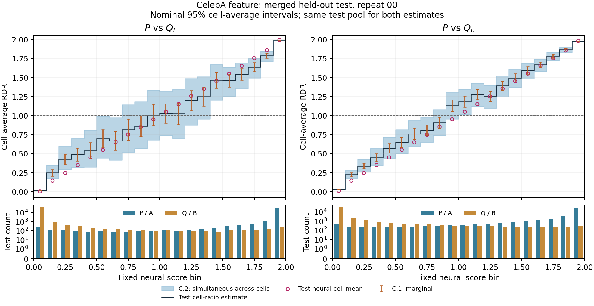
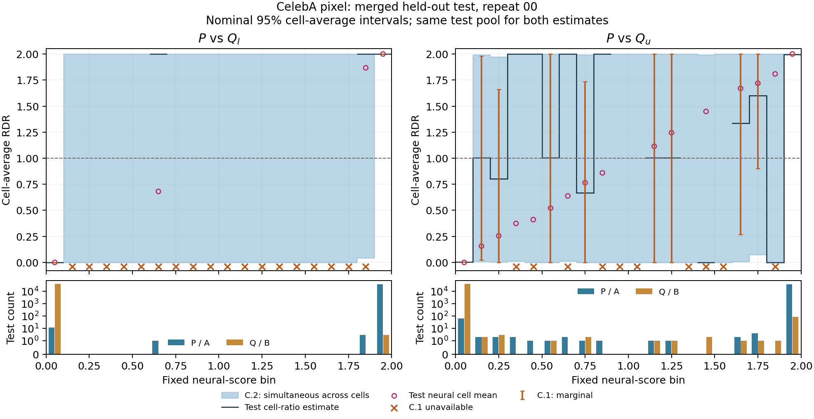
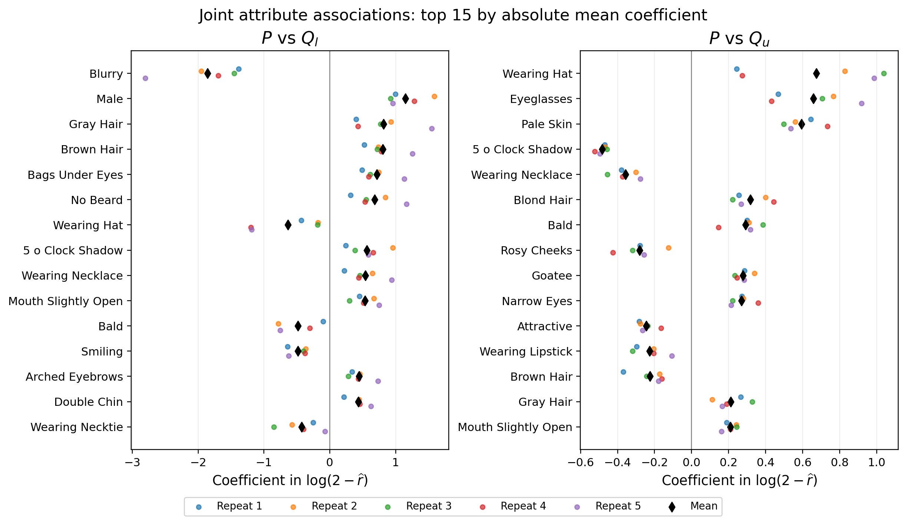
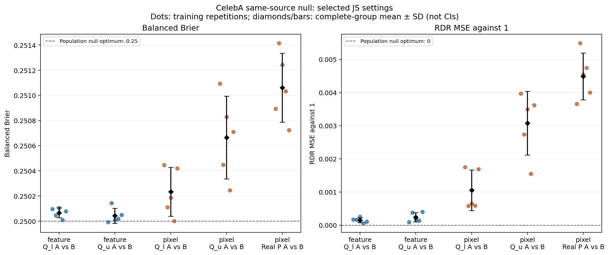
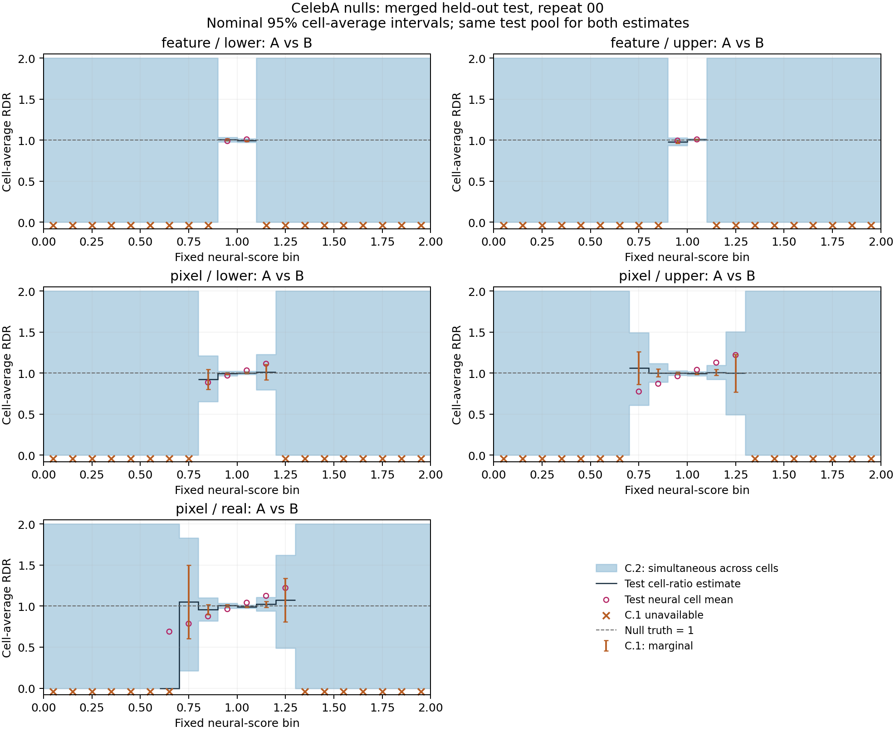

# CelebA experiments

## Expanded main result: one merged held-out test set

The main paper result uses the union of the former final-calibration and
final-evaluation halves: **39,829 real P images and 40,000 images per Q branch**.
The same test observations now supply C.1/C.2 cell-count intervals, neural
cell means, Brier, local Gap, and displayed images. Training, early stopping,
and model-selection data are unchanged. No network was retrained or selected
using the merged test data.

**Complete: 20/20 selected-model and 25/25 null assessments**, with ten updated
main CI figures, four compact ranked-image panels, four all-bin panels, and
two null diagnostic figures plus six null histogram figures, all in PNG/PDF.
The [paper package](../results/CelebA/README.md) contains **32 final figure pairs**,
including selection, attribute regression and interaction/sensitivity figures.
Superseded outputs are preserved in
[RDR-working](https://github.com/yuliangxu/RDR-working/tree/celeba-working-20261003).

- [Current merged-test results](../results/CelebA/merged_test_20261003/RESULTS.md), [main aggregates](../results/CelebA/merged_test_20261003/main_per_comparison.csv), and [main per-fit metrics](../results/CelebA/merged_test_20261003/main_per_fit.csv)
- [Merged-test protocol](../results/CelebA/merged_test_20261003/protocol.json) and [completion receipt](../results/CelebA/merged_test_20261003/COMPLETE.json)
- [Accepted model settings](../results/CelebA/final_evaluation_expanded_20261003/freeze.json)

The fixed generator is Diffusion-StyleGAN2 CelebA64 at truncation 0.650 (Q_l)
and 1.569 (Q_u). Feature models are three-hidden-layer width-512 ReLU MLPs on
training-standardized 2048-dimensional Inception pool3 features. Pixel models
are RGB64 CNNs with base width 64. All use JS loss, with
`r = 2 sigmoid(alpha z)`: alpha 0.5 for features and 2 for pixels.
Architecture selection was not performed.

### Main test results

Entries are mean (SD) across all five fitted repetitions on the same test
rows. Brier uses P-label probability `r/2`, with equal P/Q weight despite
unequal sample counts.

| Comparison | Loss | alpha | Test Brier | Local absolute Gap | Supported mass |
| --- | --- | ---: | ---: | ---: | ---: |
| Feature: P vs Q_l | JS | 0.5 | 0.021975 (0.000525) | 0.020121 (0.006135) | 1.000000 (0.000000) |
| Feature: P vs Q_u | JS | 0.5 | 0.052279 (0.000514) | 0.023471 (0.004319) | 1.000000 (0.000000) |
| Pixel: P vs Q_l | JS | 2 | 0.000235 (0.000116) | 0.000488 (0.000256) | 1.000000 (0.000000) |
| Pixel: P vs Q_u | JS | 2 | 0.003508 (0.000907) | 0.005365 (0.001821) | 1.000000 (0.000000) |

Pixel models separate P and Q much more strongly. Differences in Brier across
representations also reflect different available information and Bayes risks;
they are not a direct comparison of estimation error for a common RDR target.
Similar FID does not imply similar discriminability.

The middle region `[0.7, 1.2)` has mean mixture mass 0.011990 (feature/lower),
0.042108 (feature/upper), 0.000010 (pixel/lower), and 0.001117 (pixel/upper).
Pixel/lower middle Gap is unavailable in some repetitions and has no complete
five-repeat average; pixel/upper middle Gap is 0.249355 (SD 0.073954).
Low overall Gap does not establish accuracy in sparse middle cells.

**Supported mass is 1 by construction** when the same observations supply
cell counts and neural means. It is not an independent calibration success
criterion here. The two estimates used in local Gap are correlated; C.1/C.2
are intervals for population cell-average RDR, not for Gap, an individual
image, or the estimated neural mean. Nominal image-level intervals do not
adjust for repeated photos within identities. Repeat SD measures training
variation conditional on the data.

The merged test rows and real identities are disjoint from the current
training/development roles. Historical inspection of the original design/test
pools still makes this a **retrospective held-out assessment**, not a newly
sealed prospective test. Merging does not change that limitation.

### Exact split accounting

| Role | P images | P identities | Each Q count |
| --- | ---: | ---: | ---: |
| Training | 122,984 | 6,158 | 120,000 |
| Early stopping | 19,898 | 1,023 | 20,000 |
| Selection calibration | 9,935 | 511 | 10,000 |
| Selection evaluation | 9,953 | 500 | 10,000 |
| Merged final test | 39,829 | 1,985 | 40,000 |

The final test concatenates former calibration rows (19,906 P, 20,000 Q)
followed by former evaluation rows (19,923 P, 20,000 Q). Source IDs, identities,
manifest order and array hashes were verified before pooling. Both P/Q
comparisons share the same P observations. Only the final roles are merged;
validation-based model selection retains its original protocol.

### FID comparison

The completed [FID report](../results/CelebA/expanded_fid_20260929/FID_RESULTS.md)
uses raw canonical pytorch-fid 0.3.0 pool3 features, pooled float64 moments and
sample covariance. FID is computed on each entire pool. Its final pool now
coincides with the merged test pool used for the RDR assessment; the FID
values themselves are unchanged.

| Pool | P count | Each Q count | FID(P,Q_l) | FID(P,Q_u) | Absolute difference |
| --- | ---: | ---: | ---: | ---: | ---: |
| Training | 122,984 | 120,000 | 26.771783 | 23.965605 | 2.806177 |
| Validation | 39,786 | 40,000 | 26.861024 | 25.318431 | 1.542593 |
| Final | 39,829 | 40,000 | 26.236221 | 25.303953 | 0.932268 |

Closeness was assessed descriptively, without a strict cutoff or formal FID
equivalence test. The expanded final FID difference is about 0.93 units.

### Model selection and paper figures

The grid comprises 2 pairs × 2 representations × 4 losses × 4 sigmoid slopes
× 5 paired repetitions = 320 fits. Losses are Hellinger, KL, chi-square, JS;
slopes are 0.5, 1, 2, 4. Each checkpoint minimizes early-stopping balanced Brier.
Selection uses a paired one-SE Brier shortlist, supported mass at least 0.99
in every repetition, then minimum mean local absolute Gap.

**319/320 fits completed** (160 feature, 159 pixel). Pixel P versus Q_l,
Hellinger/slope 4, repeat 03 (`56842200_211`) failed with
`FloatingPointError: Nonfinite objective at epoch 7`. The log does not identify
the exact intermediate numerical cause. Its four successful repeats are
preserved, but no five-repeat aggregate is reported. Paper heatmaps label the
cell **Failed (1/5)**. The numerical failure affects that fit, not the entire
experiment or the completed JS final assessment.

The four recommended settings were explicitly accepted for final assessment.
For pixel/lower, the recommendation used the 15 fully completed candidates;
the omitted Hellinger/slope-4 candidate's four recorded Brier values are all
approximately 0.5. This acceptance is a documented decision following an
incomplete grid, not a claim that the original automatic selection completed.
The original automatic selector `56842201` was blocked by the failed dependency.

- [Selection report, explanation and paper caption](../results/CelebA/model_selection_expanded_20260929/RESULTS.md)
- Paper PDF figures: [feature](../results/CelebA/model_selection_expanded_20260929/selection_grid_feature.pdf), [pixel](../results/CelebA/model_selection_expanded_20260929/selection_grid_pixel.pdf)
- PNG previews: [feature](../results/CelebA/model_selection_expanded_20260929/selection_grid_feature.png), [pixel](../results/CelebA/model_selection_expanded_20260929/selection_grid_pixel.png)
- [Selection protocol](../results/CelebA/model_selection_expanded_20260929/protocol.json) and [presentation receipt](../results/CelebA/model_selection_expanded_20260929/presentation_receipt.json)

Red boxes show the accepted settings. Figure/report presentation was refreshed
without modifying frozen training source, checkpoints, or numeric results.

### Selected-model CI plots and compact sample images

The [current figure gallery](../results/CelebA/merged_test_20261003/RESULTS.md#all-figures) includes C.1/C.2
plots for all five repetitions. Each main CI plot has **one test-count panel**,
with P and Q counts. Both the cell-ratio estimate and neural mean use the same
merged test observations. C.1 is nominal 95% marginal; C.2 is nominal 95%
simultaneous over the 20 cells of one fitted comparison. Empty test cells
retain C.2 `[0,2]` and no point estimate; unavailable C.1 intervals are explicit.





CI PDFs: [feature](../results/CelebA/merged_test_20261003/figures/ci_feature_repeat_00.pdf) and
[pixel](../results/CelebA/merged_test_20261003/figures/ci_pixel_repeat_00.pdf). The gallery also includes
repeats 01–04. Intervals are not averaged across different fitted score cells.

The compact main panels follow the publication layout: two source rows
(real P, generated Q), three columns, and 40 images per group in a 4-by-10 grid.
For each source independently, select the **globally smallest RDRs, closest to
1, and largest RDRs**. There are no preset broad-range restrictions. Titles
show the actual minimum and maximum among the displayed images, at three
significant digits; the CSVs retain full precision. Exact ties use fixed seeded ordering. Repeat 00 remains
the predetermined illustration, not a best-performing or best-looking fit.

For strongly separated pixel models, the 40 closest available scores to 1
can still span a wide range. The labels report that range rather than imply
all 40 lie near 1. Independently selected groups may overlap; examples are
illustrations, not prevalence estimates. Images and neural scores are unchanged.


| Comparison | Compact ranked PDF | All 20 bins PDF |
| --- | --- | --- |
| Feature / lower | [PDF](../results/CelebA/publication_figures_20261003_v2/images_feature_lower_ranked.pdf) | [PDF](../results/CelebA/merged_test_20261003/figures/images_feature_lower_all_bins.pdf) |
| Feature / upper | [PDF](../results/CelebA/publication_figures_20261003_v2/images_feature_upper_ranked.pdf) | [PDF](../results/CelebA/merged_test_20261003/figures/images_feature_upper_all_bins.pdf) |
| Pixel / lower | [PDF](../results/CelebA/publication_figures_20261003_v2/images_pixel_lower_ranked.pdf) | [PDF](../results/CelebA/merged_test_20261003/figures/images_pixel_lower_all_bins.pdf) |
| Pixel / upper | [PDF](../results/CelebA/publication_figures_20261003_v2/images_pixel_upper_ranked.pdf) | [PDF](../results/CelebA/merged_test_20261003/figures/images_pixel_upper_all_bins.pdf) |

All-bin supplements use the same merged pool, with up to four uniformly
sampled images per source/cell and explicit empty bins. Their ten-row,
four-column layout keeps all 20 fixed bins compact.

Audit exports: [image IDs and scores](../results/CelebA/merged_test_20261003/selected_images.csv),
[actual group ranges and counts](../results/CelebA/merged_test_20261003/image_groups.csv), and
[all 900 main/null cell records](../results/CelebA/merged_test_20261003/cell_intervals.csv).
Earlier split-based figures are preserved in
[RDR-working](https://github.com/yuliangxu/RDR-working/tree/celeba-working-20261003/results/CelebA/final_evaluation_expanded_20261003/figures).

## Feature RDR attribute associations

The old DDIM analysis is now reproduced for both selected feature RDRs on all
**39,829 real test images (1,985 identities)**. For each of the five saved
repetitions per pair, fit jointly

$$\log(2-\widehat r_b(x_i))=\beta_{0b}+\sum_{j=1}^{40}\beta_{jb}A_{ij}+\varepsilon_i,$$

where $A_{ij}$ are the 40 annotated CelebA attributes, coded absent/present as
0/1. These are semantic attributes, distinct from the Inception coordinates
used to fit the RDR. Attributes are joined by image filename. Generated images
have no supplied attribute labels, so this analysis uses the real test images
for both comparisons. No RDR model is retrained.

[Full report](../results/CelebA/attribute_regression_expanded_20261003_v2/RESULTS.md), [all attribute rankings](../results/CelebA/attribute_regression_expanded_20261003_v2/attribute_summary.csv),
[per-fit coefficients and clustered intervals](../results/CelebA/attribute_regression_expanded_20261003_v2/coefficients_per_fit.csv), and
[regression diagnostics](../results/CelebA/attribute_regression_expanded_20261003_v2/regression_metrics.csv).

| Pair | Largest absolute mean coefficients across five fits | Joint R² mean (SD) |
| --- | --- | --- |
| P vs Q_l | Blurry −1.858; Male +1.150; Gray Hair +0.815; Brown Hair +0.804; Bags Under Eyes +0.714 | 0.030 (0.003) |
| P vs Q_u | Wearing Hat +0.674; Eyeglasses +0.658; Pale Skin +0.595; 5 o’Clock Shadow −0.482; Wearing Necklace −0.357 | 0.057 (0.015) |

These top-five signs agree across all five fits for each pair. A positive
coefficient associates attribute presence with larger $2-\widehat r$, hence
greater relative Q support; a negative coefficient indicates lower relative
Q support, holding the other annotations fixed. This is a conditional
association, not a causal driver or a marginal attribute-frequency difference.
**All 40 annotations together explain only about 3% and 6% of the transformed
score variation**. They describe a small part of the learned shift; correlated
attributes and real-only support limit attribution. Coefficient magnitude ranks
absent-to-present contrasts. The full tables also report prevalence-scaled
coefficients and drop-one partial R² for alternative measures of association.



[Publication PDF](../results/CelebA/attribute_regression_expanded_20261003_v2/attribute_coefficients.pdf). Colored dots are the five
fitted repetitions; black diamonds are their means. These dots describe
training variation on the same data, not independent-data confidence intervals.
The top 15 are ranked separately within each pair by absolute mean coefficient.

The per-fit tables use identity-clustered standard errors and nominal 95%
intervals, with a small-sample correction and t reference on 1,984 degrees of
freedom. BH q-values adjust across 40 attributes within each fit. Inference is
exploratory and conditional on the frozen network; it does not include model
training uncertainty or provide simultaneous guarantees over repetitions.

Some saved float32 RDRs round to exactly 2, especially for Q_l (1,847–15,634
images across its five fits). To retain every image, recover the unchanged
model logits and evaluate $\log 2-\operatorname{softplus}(\alpha z)$ in float64.
There is no epsilon clipping or row deletion. Recovered RDRs agree with saved
scores to a maximum absolute difference of $4.00\times10^{-6}$. This log
response emphasizes extreme logits, so its regression can vary even when the
bounded RDR/Brier results are similar across models.

Reproduce using the frozen source, saved checkpoints, feature arrays, and the
original CelebA annotation file:

```bash
OMP_NUM_THREADS=2 OPENBLAS_NUM_THREADS=2 MKL_NUM_THREADS=2 \
python3 -B /cwork/yx306/RDR/CelebA/attribute_regression_expanded_20261003_v2/source/experiments/CelebA/attribute_regression.py \
  --merged /cwork/yx306/RDR/CelebA/merged_test_20261003 \
  --attributes /hpc/group/mastatlab/yx306/CelebA/celeba/list_attr_celeba.txt \
  --output /cwork/yx306/RDR/CelebA/attribute_regression_replay_NEW
```

The archived `design.csv` and `responses/` retain the matched annotations and
stable responses. Compact report tables, figure, input hashes and frozen code
are exported to the repository. [Regression code](../experiments/CelebA/attribute_regression.py)
and [independent numerical audit](../results/CelebA/attribute_verification.json)
retain the pipeline and verification.

## Attribute interactions and response sensitivity

**Completed:** 20 scenarios (two pairs × two responses × five frozen RDR
models), comprising 980 EBM fits and 20 OLS fits. All array tasks in
`57489002` and report job `57489488` completed with exit code zero. These are
new attribute explanation models; the original RDR networks remain frozen.

[Full analysis](../results/CelebA/attribute_interactions_20261003/RESULTS.md), [accuracy table](../results/CelebA/attribute_interactions_20261003/metrics_summary.csv),
[all deletion-importance rankings](../results/CelebA/attribute_interactions_20261003/importance_summary.csv),
[response-ranking agreement](../results/CelebA/attribute_interactions_20261003/response_stability.csv), and
[learned interaction components](../results/CelebA/attribute_interactions_20261003/terms_per_fit.csv).

A common identity-disjoint split of the real test pool gives 23,805 images /
1,191 identities for surrogate training, 7,902 / 397 for early stopping, and
8,122 / 397 for assessment. These new roles apply only to the explanation
models. Original RDR training, selection and main assessment are unchanged.
This is one held-out split, not cross-validation; historical inspection of
the underlying pool means the analysis remains exploratory.

The comparison uses OLS, an additive Explainable Boosting Machine (EBM), and
an EBM with 10 automatically selected pairwise interactions. Settings are
fixed across scenarios. Explicit identity-separated validation assignments
control early stopping; assessment data never enter model fitting. Targets
are standardized using training rows only. The two responses are the saved
bounded RDR and the stable log(2−RDR) response from frozen logits.

| Pair | Response | Held-out OLS R² | Additive EBM R² | Interaction EBM R² |
| --- | --- | --- | --- | --- |
| P vs Q_l | RDR | 0.00648 | 0.00685 | 0.00687 |
| P vs Q_l | log(2−RDR) | 0.02669 | 0.02672 | 0.02764 |
| P vs Q_u | RDR | 0.02230 | 0.02432 | 0.02442 |
| P vs Q_u | log(2−RDR) | 0.05344 | 0.05387 | 0.05416 |

Values are means over the five RDR fits; the full table includes SD and range.
**Interactions improve mean R² over the additive EBM by less than 0.001 in
all four comparisons.** The annotation models explain little held-out score
variation: about 0.7%/2.4% for bounded RDR and 2.8%/5.4% for log(2−RDR), for
Q_l/Q_u respectively. This experiment provides little evidence that these
pairwise interactions resolve the weak explanatory power of the annotations;
it does not rule out other visual features or higher-order relationships.


[Accuracy PDF](../results/CelebA/attribute_interaction_figures_20261003/predictive_accuracy.pdf).

### Importance from removing attributes and refitting

Each interaction model is refitted after removing each of 40 attributes or
one of seven predefined related groups. The groups cover facial hair, hair,
cosmetics, accessories, expression, facial structure, and the Male/Young
annotations; their exact members are frozen in the protocol. They are not a
partition of all attributes. Importance is

$$\Delta R^2=R^2_{\mathrm{full}}-R^2_{\mathrm{reduced}}.$$

Positive values mean removal worsens held-out prediction. Negative values
are retained and mean the reduced model predicts better. This assesses
incremental predictive information after refitting, which differs from
ranking a binary attribute's OLS coefficient magnitude. Scores need not add
up to total R², and correlated attributes can share information. These are
predictive associations, not causal contributions to distributional divergence.

| Pair | Response | Top five individual attributes by mean ΔR² |
| --- | --- | --- |
| Q_l | RDR | Bags Under Eyes, Brown Hair, Male, Blurry, Wearing Necktie |
| Q_l | log(2−RDR) | Blurry, Brown Hair, Male, Bags Under Eyes, Smiling |
| Q_u | RDR | Eyeglasses, Brown Hair, 5 o’Clock Shadow, Wearing Hat, Oval Face |
| Q_u | log(2−RDR) | Eyeglasses, 5 o’Clock Shadow, Attractive, Blond Hair, Wearing Necklace |

Q_l shares four top-five attributes across the two responses; Q_u shares two.
Spearman correlations of the full 40-attribute importance rankings are 0.570
and 0.643. These results show some stable associations, with meaningful
response dependence. Removing hair-related annotations has the largest group
importance for Q_l; removing accessories has the largest for Q_u, under both
responses. Group-ranking correlations are 0.929 and 0.964. Group sizes differ,
so a larger group importance does not imply each member is more important.


[Attribute PDF](../results/CelebA/attribute_interaction_figures_20261003/attribute_importance.pdf).


[Group PDF](../results/CelebA/attribute_interaction_figures_20261003/group_importance.pdf). Blue dots are the five fitted RDR
repetitions; black diamonds are means, not confidence intervals. Only the top
12 attributes are plotted per panel; all 40 attributes and all seven groups,
including negative values, are available in the CSVs. Learned interaction-term
magnitudes in `terms_per_fit.csv` describe model components on training data
and should not be interpreted as held-out deletion importance.

The numerical audit independently checked all 940 deletion comparisons,
all held-out metrics, identity disjointness, training-only scaling, direct
OLS solutions and predictions from the saved EBMs. Three focused tests cover
identity splitting, absence of assessment-target leakage, and the ΔR² formula.
See [verification](../results/CelebA/interaction_verification.json).

For replay, use [the driver](../experiments/CelebA/attribute_interactions.py)
and [Slurm wrapper](../experiments/CelebA/attribute_interactions.slurm).
InterpretML 0.7.8 is installed separately under
`/cwork/yx306/RDR/CelebA/environments/interpret_core_0_7_8`; dependency versions
and installed-file hashes are in the protocol. Prepare a new output root,
run tasks 0–19, then generate the report only after all tasks complete:

```bash
python3 -B /cwork/yx306/RDR/CelebA/attribute_interactions_20261003/source/experiments/CelebA/attribute_interactions.py prepare \
  --output /cwork/yx306/RDR/CelebA/attribute_interactions_replay_NEW
sbatch --array=0-19%10 \
  /cwork/yx306/RDR/CelebA/attribute_interactions_replay_NEW/source/experiments/CelebA/attribute_interactions.slurm \
  /cwork/yx306/RDR/CelebA/attribute_interactions_replay_NEW fit
# After successful completion of every array task:
python3 -B /cwork/yx306/RDR/CelebA/attribute_interactions_replay_NEW/source/experiments/CelebA/attribute_interactions.py report \
  --output /cwork/yx306/RDR/CelebA/attribute_interactions_replay_NEW
python3 -B /cwork/yx306/RDR/CelebA/attribute_interaction_figures_20261003/source/experiments/CelebA/attribute_interaction_figures.py \
  --analysis /cwork/yx306/RDR/CelebA/attribute_interactions_replay_NEW \
  --output /cwork/yx306/RDR/CelebA/attribute_interaction_figures_replay_NEW
```

The separate presentation stage only changes figure layout. The original
sealed report and figures remain archived, and the repository report records
six figure-link corrections to the publication versions. Saved model files and
per-image assessment predictions remain in the HPC archive.

## Reproducible expanded-data pipeline

Preserve all source snapshots, configuration, manifests, checkpoints,
predictions, receipts and logs under the `/cwork/yx306/RDR/CelebA/` runs:
`expanded_fid_20260929`, `model_selection_expanded_20260929`, and
`final_evaluation_expanded_20261003`, `null_expanded_20261003`, and
`merged_test_20261003`, with the presentation supplement `publication_figures_20261003_v2`.
The final run references the selection
checkpoints and external source data; it is not a standalone archive.

| Stage | Reproducible code / instructions | Preserved artifacts |
| --- | --- | --- |
| Expanded pools and FID | [FID workflow](../experiments/CelebA/expanded_fid.md), [generator](../experiments/CelebA/expanded_fid_generate.py), [FID report](../experiments/CelebA/expanded_fid_report.py) | Generator/seed locks, image shards, pool3 caches, FID moments, source snapshot |
| Selection | [Protocol](../experiments/CelebA/expanded_selection.md), [configuration](../experiments/CelebA/expanded_selection_config.json), [driver](../experiments/CelebA/model_selection.py), [Slurm wrapper](../experiments/CelebA/selection.slurm) | Frozen split/data receipts, all completed fits, failure record, validation metrics |
| Accepted-model final assessment | [Driver](../experiments/CelebA/final_evaluation.py), [Slurm wrapper](../experiments/CelebA/final_evaluation.slurm) | Accepted-settings freeze, 12 verified final arrays, 20 evaluations, completion-gated report |
| Paper selection presentation | [Renderer entrypoint](../experiments/CelebA/refresh_selection_presentation.py) | Updated PNG/PDF files, caption, renderer snapshot and artifact hashes |
| Current merged-test diagnostics and figures | [Renderer](../experiments/CelebA/merged_test.py) | Twenty main and 25 null assessments from pooled saved scores; ten CI, eight image and two null figures; exact source/row hashes |
| Publication labels and null histograms | [Renderer](../experiments/CelebA/publication_figures.py) | [Four three-digit image panels and six histogram figures](../results/CelebA/publication_figures_20261003_v2/FIGURES.md); unchanged scores and image selections |
| Feature attribute associations | [Regression](../experiments/CelebA/attribute_regression.py) | [Ten joint regressions, full coefficient tables and figure](../results/CelebA/attribute_regression_expanded_20261003_v2/RESULTS.md); stable log response from frozen models |
| Attribute interactions and response sensitivity | [Driver](../experiments/CelebA/attribute_interactions.py), [publication figures](../experiments/CelebA/attribute_interaction_figures.py) | [20 completed scenarios, 940 deletion refits, three figures](../results/CelebA/attribute_interactions_20261003/RESULTS.md); identity-held-out assessment |
| Learned null controls | [Driver](../experiments/CelebA/null_experiment.py), [Slurm wrapper](../experiments/CelebA/null.slurm) | Five families, 25 fresh fits/final assessments, known-RDR error metrics and two summary/CI figures |
| Repository paper package | [Packager](../experiments/CelebA/package_paper.py), [package guide](../results/CelebA/README.md) | Byte-identical main artifacts, four frozen-source archives, SHA-256 manifest and offline verification |

To reproduce the **merged-test results and their original plots** in a new
output directory, using the preserved source and saved predictions:

```bash
OMP_NUM_THREADS=2 OPENBLAS_NUM_THREADS=2 MKL_NUM_THREADS=2 \
python3 -B /cwork/yx306/RDR/CelebA/merged_test_20261003/source/experiments/CelebA/merged_test.py \
  --main-run /cwork/yx306/RDR/CelebA/final_evaluation_expanded_20261003 \
  --null-run /cwork/yx306/RDR/CelebA/null_expanded_20261003 \
  --output /cwork/yx306/RDR/CelebA/merged_test_replay_NEW --seed 2026100301
```

Then reproduce the current three-digit image labels and null histograms using
the presentation supplement (or point `--merged` at a newly reproduced merged run):

```bash
OMP_NUM_THREADS=2 OPENBLAS_NUM_THREADS=2 MKL_NUM_THREADS=2 \
python3 -B /cwork/yx306/RDR/CelebA/publication_figures_20261003_v2/source/experiments/CelebA/publication_figures.py \
  --merged /cwork/yx306/RDR/CelebA/merged_test_20261003 \
  --output /cwork/yx306/RDR/CelebA/publication_figures_replay_NEW
```

This is CPU postprocessing: no training or network inference. The driver
verifies both parent assessments, merges saved scores in manifest order,
recomputes metrics/CIs, and selects images from the matching pooled arrays.
Use the archived source for exact saved-run replay.

To repeat final scoring in a **new, unused output directory**, retaining the
same accepted checkpoints, run from the repository root. The variable below
must name a new directory; these commands schedule work and are not needed
merely to read the completed results.

```bash
celeba_replay=/cwork/yx306/RDR/CelebA/final_evaluation_replay_NEW
python3 -B /cwork/yx306/RDR/CelebA/final_evaluation_expanded_20261003/source/experiments/CelebA/final_evaluation.py prepare \
  --parent /cwork/yx306/RDR/CelebA/model_selection_expanded_20260929 \
  --output "$celeba_replay"
python3 -B "$celeba_replay/source/experiments/CelebA/final_evaluation.py" submit \
  --output "$celeba_replay"
```

The sequence is CPU final-data materialization → GPU evaluations (four at a
time) → CPU report, with `afterok` dependencies and hash verification. It has
no training stage. For fresh selection training, follow `expanded_selection.md`
with a new output root and `expanded_selection_config.json`; a fresh training
run is distinct from replaying the accepted saved models.

To refresh the selection paper presentation without changing frozen fit source:

```bash
OMP_NUM_THREADS=2 OPENBLAS_NUM_THREADS=2 MKL_NUM_THREADS=2 \
python3 -B experiments/CelebA/refresh_selection_presentation.py \
  --output /cwork/yx306/RDR/CelebA/model_selection_expanded_20260929 \
  --accepted-run /cwork/yx306/RDR/CelebA/final_evaluation_expanded_20261003
```

Do not replace this command with the old frozen selection report command when
preparing the paper: the original renderer uses the outdated pending labels.
The refreshed renderer records its source and output hashes separately.

The existing environment and data prerequisites are described in
[the workflow README](../experiments/CelebA/README.md#commands-and-prerequisites).
Slurm account/partition settings and absolute data paths are HPC-specific.
Final evaluation passed 28 targeted/regression tests; the presentation update
passed 25 reporting/numerical checks. Earlier selection validation passed 19
focused numerical tests, 43 existing checks, a 64-fit CPU workflow and four
full-size Hellinger checks. These overlapping checks are not a single count of
unique tests. Re-run relevant checks from the repository root with:

```bash
OMP_NUM_THREADS=1 OPENBLAS_NUM_THREADS=1 MKL_NUM_THREADS=1 \
python3 -B -m pytest -q tests/test_celeba_final_evaluation.py \
  tests/test_celeba_selection_training.py tests/test_celeba_selection_data.py \
  tests/test_celeba_selection_report.py tests/test_celeba_expanded_selection.py
```

## Expanded selected-configuration null experiments

All five same-source null families completed five fresh fits using the accepted
JS configurations (feature slope 0.5, pixel slope 2). Feature array `57461851`,
pixel array `57461852` and the original report job `57461853` completed.
Their saved final predictions have now been merged across the two final roles,
using the same single-test-pool convention as the four primary comparisons.
**All 25 merged null assessments are complete; no additional fitting occurred.**

The [current null results](../results/CelebA/merged_test_20261003/RESULTS.md#learned-null-controls),
[per-fit metrics](../results/CelebA/merged_test_20261003/null_per_fit.csv), and
[five-family aggregates](../results/CelebA/merged_test_20261003/null_per_comparison.csv)
are the final paper results. The [null training protocol](../results/CelebA/null_expanded_20261003/protocol.json),
A/B allocation and checkpoints remain unchanged.

### Final null results

Mean (SD) over five training repetitions on fixed A/B halves. The true null
RDR is 1 and optimal population balanced Brier is 0.25. Counts and neural
means use the same merged test observations, with equal A/B weight.

| Null family | Balanced Brier | Local absolute Gap | RDR MSE against 1 | Supported mass |
| --- | ---: | ---: | ---: | ---: |
| Feature / lower | 0.250066 (0.000040) | 0.010761 (0.005583) | 0.000151 (0.000075) | 1.000000 (0.000000) |
| Feature / upper | 0.250042 (0.000060) | 0.010976 (0.007402) | 0.000239 (0.000142) | 1.000000 (0.000000) |
| Pixel / lower | 0.250233 (0.000194) | 0.020732 (0.010600) | 0.001052 (0.000611) | 1.000000 (0.000000) |
| Pixel / upper | 0.250665 (0.000330) | 0.040803 (0.010957) | 0.003073 (0.000961) | 1.000000 (0.000000) |
| Pixel / real | 0.251061 (0.000275) | 0.053309 (0.005364) | 0.004487 (0.000707) | 1.000000 (0.000000) |

Brier remains close to 0.25. Feature nulls have smaller RDR error and local Gap
than the corresponding pixel nulls; real-pixel nulls have the largest residual
error (mean RMSE 0.066820). No pass/fail threshold or exact-one score replacement
was used. Population excess Brier equals RDR MSE/4; empirical Brier minus 0.25
is a different finite-sample quantity and may be negative. Supported mass is
now 1 by construction under the common test-pool calculation.



[Summary PDF](../results/CelebA/merged_test_20261003/figures/null_summary.pdf). Dots are individual repetitions;
diamonds/bars are mean and SD, not confidence intervals.



[CI PDF](../results/CelebA/merged_test_20261003/figures/null_ci_repeat_00.pdf). Repeat 00 is fixed; reference
RDR is 1. C.2 simultaneity is within one comparison. These fixed-data repeats
do not establish empirical coverage or account for real-identity clustering.

### Learned-null RDR histograms


[Overview PDF](../results/CelebA/publication_figures_20261003_v2/null_rdr_histograms.pdf). Rows show the five null families;
columns show repetitions 1–5 (archived 00–04). Blue and red histograms display
folds A and B on the merged test data, using 400 equal bins on [0,2] and a
dashed reference at the known null RDR 1. Panel titles report balanced RDR RMSE
against 1. The shading is the central 95% of the equally weighted A/B score
distributions, **not a confidence interval**. The learned scores are unchanged.

For paper placement, use the separate family PDFs at their native 7.2-inch
width: 10-point ticks/panel titles and 12-point axis labels remain readable.
The 25-panel overview uses 19-point ticks/panel titles and is suitable for a
full-page supplement. All files include PNG previews and vector PDF exports.

| Null family | Publication PDF |
| --- | --- |
| Feature / lower | [Five repeats](../results/CelebA/publication_figures_20261003_v2/null_rdr_histograms_feature_lower.pdf) |
| Feature / upper | [Five repeats](../results/CelebA/publication_figures_20261003_v2/null_rdr_histograms_feature_upper.pdf) |
| Pixel / lower | [Five repeats](../results/CelebA/publication_figures_20261003_v2/null_rdr_histograms_pixel_lower.pdf) |
| Pixel / upper | [Five repeats](../results/CelebA/publication_figures_20261003_v2/null_rdr_histograms_pixel_upper.pdf) |
| Pixel / real | [Five repeats](../results/CelebA/publication_figures_20261003_v2/null_rdr_histograms_pixel_real.pdf) |

[Exact histogram summaries](../results/CelebA/publication_figures_20261003_v2/null_histogram_summary.csv) and
[bin counts/densities](../results/CelebA/publication_figures_20261003_v2/null_histogram_bins.csv) preserve the plotted data.

### Null splits and reproducible pipeline

Within each original role, same-source A/B halves remain disjoint, with real
identities allocated together. Merging the final roles keeps A versus B
separate; it only joins each side's former calibration and evaluation rows.
The driver verified that A/B are disjoint and together equal the full final
source pool. Five repetitions share the same splits. Training and development
roles retain the original allocation.

| Role | Real A | Real B | Each generated source A | Each generated source B |
| --- | ---: | ---: | ---: | ---: |
| Training | 61,495 | 61,489 | 60,000 | 60,000 |
| Early stopping | 9,952 | 9,946 | 10,000 | 10,000 |
| Development calibration | 4,958 | 4,977 | 5,000 | 5,000 |
| Development evaluation | 4,975 | 4,978 | 5,000 | 5,000 |
| Merged final test | 19,911 | 19,918 | 20,000 | 20,000 |

The original split seed is `2026100303` and training seed is `2026100304`.
All learned weights, stopping-Brier checkpoints and training-only feature
standardization are unchanged. A real-feature null would be a sixth family
and is outside this study. Historical signed Hellinger diagnostics remain
in the earlier split-based report; they are not reused as merged-test estimates.

The [null fitting driver](../experiments/CelebA/null_experiment.py),
[data adapter](../experiments/CelebA/null_data.py), and
[Slurm wrapper](../experiments/CelebA/null.slurm) reproduce fresh null fitting.
The [merged-test driver](../experiments/CelebA/merged_test.py) reproduces the
current assessment and figures using the already fitted models' saved scores.
Use the merged replay command above for the current paper results.

For a separate fresh null training run, use a new output directory:

```bash
celeba_null_output=/cwork/yx306/RDR/CelebA/null_expanded_NEW
OMP_NUM_THREADS=2 OPENBLAS_NUM_THREADS=2 MKL_NUM_THREADS=2 \
python3 -B experiments/CelebA/null_experiment.py prepare \
  --parent /cwork/yx306/RDR/CelebA/final_evaluation_expanded_20261003 \
  --output "$celeba_null_output"
python3 -B "$celeba_null_output/source/experiments/CelebA/null_experiment.py" submit \
  --output "$celeba_null_output"
```

This keeps the original training protocol. Pool its final predictions with
the merged-test driver before reporting under the current paper convention.
Fresh training is distinct from replaying the completed results.

## Experiment inventory

Updated 2026-10-03. The expanded study supplies the main paper results and
figures. Execution status and intended paper role are listed separately:
an optional analysis is not a pending job, and a failed fit is not an
unfinished paper-inclusion decision. The null study is complete, with all
25 fits and final assessments verified and the final report published.

### Expanded study

| Stage | Execution status | Paper role | Reproducible pipeline and artifacts |
| --- | --- | --- | --- |
| Generator samples and FID | Complete for training, validation, and final pools; FID pairs are descriptively close, without an equivalence cutoff. | Main data and FID comparison. | [Generation](../experiments/CelebA/expanded_fid_generate.py), [FID report code](../experiments/CelebA/expanded_fid_report.py), [results](../results/CelebA/expanded_fid_20260929/FID_RESULTS.md). |
| Loss/output-activation selection | 319/320 fits complete; pixel/lower Hellinger, alpha 4, repeat 03 failed with a nonfinite objective. Accepted settings are JS, alpha 0.5 for both feature comparisons and alpha 2 for both pixel comparisons. | Model-selection plots and explicit failure annotation; architectures remain fixed. | [Selection driver](../experiments/CelebA/model_selection.py), [expanded protocol](../experiments/CelebA/expanded_selection.md), [plot renderer](../experiments/CelebA/refresh_selection_presentation.py), [results](../results/CelebA/model_selection_expanded_20260929/RESULTS.md). |
| Selected-model final assessment | Complete: 20/20 saved-model evaluations and merged-test assessments, four comparisons with five repetitions each. | Main Brier, local Gap, supported-mass, and score-region results. | [Evaluation driver](../experiments/CelebA/final_evaluation.py), [Merged assessment](../experiments/CelebA/merged_test.py), [results](../results/CelebA/merged_test_20261003/RESULTS.md). |
| Selected-model C.1/C.2 and example images | Complete on the merged test pool: 20 cell tables, 10 CI figures and 8 compact image panels, each in PNG/PDF. | Requested CI and per-bin image figures; fixed repeat 00 illustrates images, with CIs available for all repeats. | [Merged-test renderer](../experiments/CelebA/merged_test.py), [current gallery and provenance](../results/CelebA/merged_test_20261003/RESULTS.md). |
| Feature RDR attribute regression | Complete: 10 joint regressions, two pairs × five repetitions, 40 annotations, all real test images. | Exploratory attribute associations; low explained variation (3% / 6%), clustered intervals, coefficient plot. | [Code](../experiments/CelebA/attribute_regression.py), [results](../results/CelebA/attribute_regression_expanded_20261003_v2/RESULTS.md). |
| Attribute interactions and response sensitivity | Complete: 20/20 scenarios, 980 EBM + 20 OLS fits; array 57489002 and report 57489488 completed. | Exploratory held-out predictive importance, related-group removal, RDR/log-response comparison; interactions add little accuracy. | [Code](../experiments/CelebA/attribute_interactions.py), [results](../results/CelebA/attribute_interactions_20261003/RESULTS.md). |
| Learned same-source nulls with selected configurations | Complete: 25/25 fresh fits and final assessments, five per family; no failures. Both arrays (`57461851`, `57461852`) and report `57461853` completed. | Final null controls: feature/pixel Q_l and Q_u, plus pixel real P; aggregate metrics, Brier/RDR-error summary, C.1/C.2 figure and six RDR histogram figures are available. | [Null driver](../experiments/CelebA/null_experiment.py), [data adapter](../experiments/CelebA/null_data.py), [Merged assessment](../experiments/CelebA/merged_test.py), [final report](../results/CelebA/merged_test_20261003/RESULTS.md#learned-null-controls). |

Completion is verified from saved receipts and the final report. Five
repetitions share fixed data splits and measure training variation. The
selected-model assessment and null study have separate completion records.
Commands and exact split counts appear in the sections above;
expanded source lives in `experiments/CelebA/`, with frozen run-specific source
and larger artifacts under `/cwork/yx306/RDR/CelebA/`.

### Analyses not performed for the expanded selected models

| Analysis | Current status | Follow-up scope |
| --- | --- | --- |
| Primary-comparison global divergence and paired bootstrap contrasts | Not rerun with the accepted expanded-data models. | Needed only if the paper retains these claims; historical estimates cannot be relabeled as expanded results. |
| Primary-comparison score-distribution summaries | Not rerun separately; final scores and cell diagnostics are saved. All five null families now have RDR histograms. | Recreate primary-comparison histograms only if needed. |
| Architecture sensitivity | Not performed in the expanded study. | Optional separate study; current selection covers loss and output activation. |

A real-feature null would add a sixth family and is outside the approved
five-family rerun. Neither this extension nor the optional analyses above is
currently a queued experiment.

## Closeout and reproduction limits

The expanded experiment is finalized: 20 selected-model assessments, 25 learned
null controls, feature-attribute regressions and interaction/response sensitivity.
The paper package retains 32 current PNG/PDF pairs, numerical tables, split
records, accepted settings, failure evidence, and reproducible code. Use these
expanded results and their captions when updating the manuscript.

The complete pre-cleanup tree was published first to
[RDR-working](https://github.com/yuliangxu/RDR-working/tree/celeba-working-20261003)
(commit `6712ddc3cc0336182b5c89ed1af13036b56a2565`). The cleanup removes unused
DDIM/real-halves runners, superseded smaller-data workflows, old figure revisions
and duplicate reports from the paper checkout. The required generator/Inception
and Hellinger support modules remain in `experiments/JRSSB/`.
[CLEANUP.json](../results/CelebA/CLEANUP.json) records the removed paths and verified
rollback archive. External research data, predictions and checkpoints are preserved.

No additional scientific run is required for the agreed scope. Global divergence
contrasts, architecture sensitivity and a sixth real-feature null remain optional;
do not use older estimates as if they came from the selected expanded models.
Keep the failed selection cell, retrospective interpretation, cell-average CI
targets and identity-dependence limitations in the paper.

The artifact package can be verified without HPC access. Full replay/refitting
still requires the archived inputs and environment described in
[REPRODUCTION.md](../results/CelebA/REPRODUCTION.md). A fresh-machine training
release needs a distributable complete split/input bundle, configurable roots,
a pinned environment and an end-to-end installation check. Those portability
steps are distinct from the completed scientific experiment.
