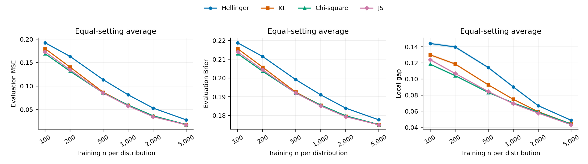

# Simulations

The retained workflow is **toy illustrations → model selection → matched loss
comparison → sample-size convergence**. All retained fitted studies are complete:
**13,300 distinct scientific fits** (1,300 in selection/follow-up and 12,000 in
fresh convergence), plus **1,200 exact timing replays** of convergence fits.
The reused Hellinger references and timing replays are not extra independent
scientific repetitions.

At B8-Res64 with output slope 2, all four losses improve as training size grows.
At 5,000 observations per distribution, KL and JS have similar MSE/Brier;
JS has the lowest mean local gap. Hellinger has the highest observed mean MSE,
Brier and local gap in all 30 convergence setting/sample-size combinations
under the common fitting recipe. This compares losses at the fixed selected
architecture and activation, without separate optimization for each loss.

[Reproduction commands](../experiments/simulations/README.md) cover fresh fitting
and regeneration of reports from saved fits. The compact
[numerical evidence](../results/simulations/README.md), including per-fit metrics,
protocols and checksums, is included in this repository.

## Design and evaluation criteria

The population is a three-component Gaussian-mixture pair with a two-dimensional
signal, embedded into dimension $D$ with independent Gaussian noise of standard
deviation $\sigma$. The five settings are $(D,\sigma)=(2,0),(20,0.1),(40,0.1),
(40,0.3),(100,0.3)$. Component means, covariance matrices, mixture weights and
the fixed embedding are defined in
[population.py](../experiments/simulations/population.py). Analytic truth includes
the convolution with observation noise.

For $M=(P+Q)/2$, the target is $r_0=2p/(p+q)$ and the network outputs
$\hat r(x)=2\operatorname{sigmoid}(\alpha z(x))$. The completed selection and
matched-loss studies have ten fitting repetitions per setting, with these
counts **per distribution**:

| Role | P | Q | Use |
| --- | ---: | ---: | --- |
| Training | 1,000 | 1,000 | Fit the network. |
| Validation | 500 | 500 | Choose each objective's minimum-loss checkpoint; compare candidates by Brier. |
| Calibration | 5,000 | 5,000 | Estimate cell-average RDR and confidence intervals. |
| Evaluation | 10,000 | 10,000 | Compute MSE/Brier, cell neural means and mixture masses. |

Sample roles and P/Q use independent random streams. Within a case/repetition,
candidates share observations and network initialization when architectures
match. Fits use full-batch AdamW, learning rate 0.0005, weight decay 0.01,
gradient-norm clipping at 1, and the common scheduler/stopping recipe in
[workflow.py](../experiments/simulations/workflow.py) and
[training.py](../utils/training.py). Minimum/maximum epochs are 300/1,000;
stopping patience is 30, and the absolute minimum own-validation-loss checkpoint
is restored. The reproducible design seed is 2026092601.

- **MSE:** $\mathbb E_M[(\hat r-r_0)^2]$, estimated using analytic truth on evaluation observations.
- **Balanced Brier:** $\tfrac12\mathbb E_P[(\hat r/2-1)^2]+\tfrac12\mathbb E_Q[(\hat r/2)^2]$, using source labels. Population Brier equals one quarter of MSE plus an estimator-independent constant.
- **Local calibration:** the absolute cell discrepancy defined below, accompanied by interval widths and supported mass.

Scientific tables show mean (Monte Carlo standard error); computation-cost
tables instead show mean (sample standard deviation). Settings receive equal
weight. With $K=5$, use $R=10$ for selection/follow-up and $R=100$ for convergence.
The aggregate scientific SE is
$\sqrt{\sum_{k=1}^K s_k^2/R}/K$, using within-setting repetition variances.
Paired differences use the same formula on within-repetition differences.
**Bold identifies the lowest observed mean within each error column**, without
a significance claim. Selection-stage evaluation and the follow-up chosen after
inspecting it are design evidence, not a fresh final test of a chosen procedure.

## Model selection: 1,150 fits

The grid contains four losses at MLP32/slope 2, plus the 20 Hellinger combinations
of five architectures and slopes 1–4. Their shared baseline is counted once,
leaving 23 distinct candidates per setting/repetition. Validation Brier selects
one configuration **among the Hellinger candidates**, as prespecified.

### Loss at MLP32, slope 2

| Loss | Validation Brier | MSE | Evaluation Brier | Local gap |
| --- | ---: | ---: | ---: | ---: |
| Hellinger | 0.20225 (0.00147) | 0.12753 (0.00411) | 0.20269 (0.00105) | 0.10363 (0.00395) |
| KL | 0.19669 (0.00124) | 0.10587 (0.00254) | 0.19725 (0.00068) | 0.08537 (0.00296) |
| Chi-square | **0.19598 (0.00118)** | **0.10225 (0.00184)** | **0.19635 (0.00050)** | 0.07440 (0.00216) |
| JS | 0.19609 (0.00118) | 0.10252 (0.00201) | 0.19643 (0.00052) | **0.07412 (0.00226)** |

Chi-square has the lowest mean MSE and Brier at this baseline; JS has the
smallest local gap. Hellinger is worse on these aggregate criteria.

### Output slope with Hellinger and B8-Res64

| Slope α | Validation Brier | MSE | Evaluation Brier | Local gap |
| --- | ---: | ---: | ---: | ---: |
| 1 | 0.19126 (0.00128) | 0.08200 (0.00426) | 0.19134 (0.00105) | 0.09338 (0.00392) |
| 2 | **0.19055 (0.00124)** | **0.07863 (0.00423)** | **0.19051 (0.00106)** | 0.08568 (0.00354) |
| 3 | 0.19093 (0.00162) | 0.08098 (0.00606) | 0.19113 (0.00151) | 0.08280 (0.00380) |
| 4 | 0.19061 (0.00173) | 0.07957 (0.00671) | 0.19081 (0.00168) | **0.07758 (0.00280)** |

Slope 2 has the lowest validation Brier. Its advantage over slope 4 is small:
the paired slope-4-minus-slope-2 validation Brier difference is 0.00005345
(SE 0.00107963). These results do not establish a clear superiority of slope 2.

### Architecture with Hellinger, slope 2

| Architecture | Validation Brier | MSE | Evaluation Brier | Local gap |
| --- | ---: | ---: | ---: | ---: |
| MLP32 | 0.20225 (0.00147) | 0.12753 (0.00411) | 0.20269 (0.00105) | 0.10363 (0.00395) |
| MLP64 | 0.20325 (0.00132) | 0.13031 (0.00409) | 0.20344 (0.00103) | 0.11332 (0.00442) |
| Deep64 | 0.20097 (0.00154) | 0.12106 (0.00476) | 0.20111 (0.00119) | 0.11166 (0.00512) |
| Res64 | 0.20258 (0.00126) | 0.12839 (0.00358) | 0.20299 (0.00088) | 0.11885 (0.00382) |
| B8-Res64 | **0.19055 (0.00124)** | **0.07863 (0.00423)** | **0.19051 (0.00106)** | **0.08568 (0.00354)** |

B8-Res64 uses a learned linear bottleneck of $\min(D,8)$ coordinates followed
by a width-64 residual network. It improves all four aggregate criteria in this
controlled architecture comparison. MLP32/MLP64 have three hidden linear layers. Deep64 has a stem followed by
three two-layer blocks without skip connections; Res64 uses the same blocks
with residual connections, all at width 64. Exact
architectures are defined in [networks.py](../utils/networks.py).

The joint 20-candidate Hellinger search selects **B8-Res64, slope 2**. The
activation and architecture tables above are conditional views of that joint
search, not independently combined winners. Full setting-by-candidate results
are retained in [summary.csv](../results/simulations/model_selection/summary.csv).

## Matched loss comparison: 150 additional fits

KL, chi-square and JS were fitted at B8-Res64/slope 2, using the same samples,
initializations and optimization recipe as the 50 existing Hellinger fits.
Every objective retains its own validation-loss checkpoint rule. The comparison
contains 200 model records but only 150 new fits.

| Loss | Validation Brier | MSE | Evaluation Brier | Local gap |
| --- | ---: | ---: | ---: | ---: |
| Hellinger | 0.19055 (0.00124) | 0.07863 (0.00423) | 0.19051 (0.00106) | 0.08568 (0.00354) |
| KL | **0.18526 (0.00092)** | **0.05770 (0.00148)** | **0.18533 (0.00045)** | 0.07418 (0.00249) |
| Chi-square | 0.18563 (0.00090) | 0.05852 (0.00131) | 0.18553 (0.00041) | 0.06761 (0.00239) |
| JS | 0.18581 (0.00113) | 0.05920 (0.00346) | 0.18574 (0.00089) | **0.06666 (0.00281)** |

KL has the lowest aggregate validation Brier, evaluation MSE and evaluation
Brier. JS has the smallest aggregate local gap. The loss ranking depends on the
setting; the smallest observed evaluation errors are:

| Dimension | Noise SD | MSE winner | Brier winner | Local-gap winner |
| ---: | ---: | --- | --- | --- |
| 2 | 0.00 | KL | KL | KL |
| 20 | 0.10 | JS | JS | JS |
| 40 | 0.10 | JS | JS | JS |
| 40 | 0.30 | KL | KL | JS |
| 100 | 0.30 | JS | JS | JS |

Hellinger has the largest mean evaluation MSE and Brier in all five settings.
The paired Hellinger-minus-KL MSE difference is **0.02093 (SE 0.00352)**;
the Brier difference is **0.00518 (SE 0.00086)**. All paired contrasts are in
[paired_comparisons.csv](../results/simulations/loss_comparison/paired_comparisons.csv).
These comparisons evaluate losses at a common architecture and activation;
they do not search an individually optimized architecture for every loss.

## Local gap and calibration intervals

For each frozen network, divide $[0,2]$ into 20 equal-width score bins $I_j$,
with model-dependent regions $A_j=\{x:\hat r(x)\in I_j\}$. Independent calibration
counts $k_{Pj},k_{Qj}$ give

$$
\hat\theta_j=\frac{2k_{Pj}}{k_{Pj}+k_{Qj}},
\qquad
\theta_j=\mathbb E_M[r_0(X)\mid X\in A_j].
$$

On the separate 20,000-observation balanced evaluation sample, let $N_j$ denote
the count in $A_j$ and define

$$
\bar r_j=\frac{1}{N_j}\sum_{i:X_i\in A_j}\hat r(X_i),
\qquad w_j=\frac{N_j}{20{,}000},
\qquad
G=\frac{\sum_{j\in J}w_j|\bar r_j-\hat\theta_j|}{\sum_{j\in J}w_j},
$$

where $J=\{j:k_{Pj}+k_{Qj}>0,\ N_j>0\}$. The local gap is $G$, averaged over
repetitions and settings as above. Supported evaluation mass was 100% for all
200 matched-loss models. This statistic uses labels and predictions, not
analytic truth or CI endpoints. It includes calibration/evaluation sampling
noise and measures binned discrepancy rather than pointwise RDR error.

The default is nominal 95% **C.2 simultaneous bands across 20 cells of each
frozen network**, with C.1 asymptotic marginal intervals alongside them. Both
target population cell-average RDR. They are not individual-RDR intervals,
do not include uncertainty in the estimated neural means, and do not give a
simultaneous guarantee across model selection. Width and supported mass are
context for interpreting the gap, not standalone winner criteria. Current runs
use fixed bins; adaptive merging remains optional in the shared implementation.

## Toy illustrations

[toy_illustrations.ipynb](../experiments/simulations/toy_illustrations.ipynb)
combines Gaussian tail separation and three beta-mixture mismatch examples.
Analytic densities and ordinary/relative ratios illustrate the estimands;
neural fits use separate training, validation and evaluation observations.
The notebook retains its executed examples and can be rerun from top to bottom.

## Completed four-loss convergence: 12,000 fits

The study compares **Hellinger, KL, chi-square and JS**, holding **B8-Res64 and
output slope 2** fixed. Training counts per distribution are
$\{100,200,500,1000,2000,5000\}$, with 100 repetitions in each of five settings:
$5\times100\times6\times4=12{,}000$ fits. Per-distribution validation,
calibration and evaluation counts remain 500, 5,000 and 10,000. Only the
training sample budget changes.

A fresh convergence random namespace separates assessment from selection and
the matched-loss follow-up. Within a setting/repetition, losses and sample sizes
share initialization and validation/calibration/evaluation observations.
Training observations are shared across losses at each size and independently
seeded by size, so they are not nested. Sample roles remain independent. The
optimizer, scheduler, stopping rule and each loss's minimum-validation-loss
checkpoint rule are unchanged. Architecture and activation are fixed throughout.

The table gives equal-setting means (Monte Carlo SE), using 100 repetitions per
setting. **Bold marks the lowest observed mean in each column.**

| Loss | MSE, n=100 | MSE, n=5,000 | Brier, n=5,000 | Local gap, n=5,000 |
| --- | ---: | ---: | ---: | ---: |
| Hellinger | 0.19232 (0.00163) | 0.02799 (0.00102) | 0.17771 (0.00026) | 0.04868 (0.00065) |
| KL | 0.17971 (0.00168) | **0.01731 (0.00030)** | **0.17504 (0.00009)** | 0.04412 (0.00047) |
| Chi-square | **0.16902 (0.00143)** | 0.01803 (0.00017) | 0.17521 (0.00007) | 0.04414 (0.00045) |
| JS | 0.17304 (0.00140) | 0.01747 (0.00059) | 0.17506 (0.00016) | **0.04317 (0.00042)** |

MSE and Brier means decrease at **every tested size increment for every loss
and setting**. Overall MSE falls by 85–90% from n=100 to n=5,000, including a
further 47–51% reduction between n=2,000 and n=5,000. These finite-protocol
results show improvement over the tested range; they do not estimate an
asymptotic rate or guarantee monotonicity in individual repetitions.

KL has the smallest final mean MSE/Brier, but its lead over JS is small: at
n=5,000, JS-minus-KL MSE is **0.000159 (paired MCSE 0.000345)**, and the Brier
difference is **0.000026 (MCSE 0.000088)**. The observed mean ordering does not
establish a clear accuracy winner between them. JS has the smallest final mean
local gap. Hellinger has the largest mean of all three errors in every one of
the 30 setting/sample-size combinations. Valid high-error repetitions were
retained without trimming or selective reruns.

Ribbons show one Monte Carlo SE. The
[per-setting curves](../results/simulations/convergence/figures/convergence_by_setting.png),
[all 120 setting summaries](../results/simulations/convergence/summary.csv),
[paired Hellinger contrasts](../results/simulations/convergence/paired_comparisons.csv)
and [publication tables](../results/simulations/convergence/tables.tex) are
included in the repository. Local gaps are occasionally nonmonotone in small
samples. They include finite calibration/evaluation noise; these sample counts
stay fixed while training grows. Supported evaluation mass is at least 99.95%
for all 12,000 fits, using each fit's supported-mass normalization.

The completed report verified the full fit grid before writing its completion
marker. Reproduction uses `convergence.py prepare`,
3,000 logical `fit` tasks and the copied source's `report` command; see the
[full instructions](../experiments/simulations/README.md#four-loss-sample-size-convergence).

## Computation cost

A separate benchmark replays repetitions 0–9 of the frozen convergence design
for every setting, size and loss: **10 timing repetitions per cell**. The completed report job verified that all 1,200
replays match their original model parameters, complete training histories and
training metadata exactly. They are not additional independent accuracy fits.

The table shows **mean training wall seconds (sample SD)** at **n=5,000 per
distribution**, on one **Intel Xeon Gold 6226 CPU at 2.70 GHz**, with one
numerical-library thread. These parentheses describe runtime variability,
not Monte Carlo SE.

| Dimension | Noise SD | Hellinger | KL | Chi-square | JS |
| ---: | ---: | ---: | ---: | ---: | ---: |
| 2 | 0.00 | 15.90 (7.47) | 14.47 (3.06) | 13.84 (2.29) | 13.03 (1.03) |
| 20 | 0.10 | 18.37 (8.41) | 15.47 (3.95) | 14.16 (1.85) | 17.75 (7.87) |
| 40 | 0.10 | 13.24 (0.61) | 14.12 (1.77) | 14.28 (1.98) | 13.92 (1.63) |
| 40 | 0.30 | 13.20 (0.65) | 13.52 (0.80) | 13.92 (1.66) | 13.25 (0.41) |
| 100 | 0.30 | 14.19 (7.64) | 11.97 (1.20) | 11.83 (1.30) | 12.15 (1.21) |

Across settings, mean wall time at n=1,000 is 4.18/4.30/4.18/4.16 seconds for
Hellinger/KL/chi-square/JS; at n=5,000 it is 14.98/13.91/13.60/14.02 seconds.
Individual setting/loss means at n=5,000 range from 11.83 to 18.37 seconds.
CPU time is about 1% below wall time. Runtime differences also reflect
loss-dependent stopping epochs: 1,198 replays stopped by validation patience,
while two reached the 1,000-epoch limit.

Timing covers the fitting call, including validation, early stopping and
checkpoint restoration. It excludes data generation, model construction,
evaluation/calibration diagnostics, file output and scheduler waiting.
An untimed one-epoch warm-up for each loss precedes measurement; loss order
rotates across tasks, and actual models use their original seeds. At most four
benchmark workers were requested concurrently. Shared-node contention can
affect wall time, so CPU time and hardware metadata are recorded alongside it.

The repository includes [all 120 cost summaries](../results/simulations/computation_cost/cost_summary.csv),
[per-fit timing records](../results/simulations/computation_cost/cost_results.csv),
[hardware details](../results/simulations/computation_cost/cost_hardware.json),
[wall-time LaTeX tables](../results/simulations/computation_cost/cost_tables.tex)
and [CPU-time/epoch tables](../results/simulations/computation_cost/cost_appendix_tables.tex).
Wall-time tables at every sample size are available for
[D=2/noise 0](../results/simulations/computation_cost/figures/table_01.png),
[D=20/noise 0.1](../results/simulations/computation_cost/figures/table_02.png),
[D=40/noise 0.1](../results/simulations/computation_cost/figures/table_03.png),
[D=40/noise 0.3](../results/simulations/computation_cost/figures/table_04.png) and
[D=100/noise 0.3](../results/simulations/computation_cost/figures/table_05.png).

The [verification record](../results/simulations/completed_studies_verification.json)
documents successful completion of both the convergence study and timing
benchmark. Original run locations are retained in the
[provenance manifest](../results/simulations/provenance.json).

## Reproduction and provenance

The [simulation README](../experiments/simulations/README.md) provides environment,
smoke, full-fitting, saved-result rendering and convergence commands. The active
code consists of the toy notebook, population/configuration, common workflow,
publication renderer, matched-loss wrapper, four-loss convergence runner and
renderer, matched computation-cost replay/reporting, and optional Slurm launchers.
Reusable algorithms remain in `utils`; superseded simulation readers and
historical result narratives have been removed from the active checkout.

The [evidence manifest](../results/simulations/provenance.json) records versions,
source and CSV hashes and the original run identifiers. Numerical summaries
were independently checked against per-fit metrics and calibration summaries.
The completed-run audit rechecked all 120 convergence setting summaries, 24
equal-setting summaries, 108 paired contrasts and 720 cost means/SDs; the
[verification record](../results/simulations/completed_studies_verification.json)
also retains successful accounting for all 550 array tasks and both reports.
Large checkpoint/prediction artifacts remain outside Git; synthetic data and
all reports can be regenerated using the retained code.

Verification covers clean-copy execution, a real 16-fit/two-size convergence
smoke report, paired/fresh random streams, source and artifact tamper rejection,
completion guards, and exact timing replay. The release check passed all **105
tests**, and the toy notebook completed all six fits through a Jupyter kernel
from a clean source copy. The completed follow-up's 24 report
artifacts were reproduced byte for byte from archived fits, with all 1,460
consumed hashes verified. An additional audit reread at least 7,000 original
convergence fits before storage stalled; this limitation is recorded separately
from the full-grid checks performed by the successful report jobs.

The repository includes [model-selection summaries](../results/simulations/model_selection/summary.csv),
[matched-loss summaries](../results/simulations/loss_comparison/summary.csv),
[convergence summaries](../results/simulations/convergence/summary.csv) and
[computation-cost summaries](../results/simulations/computation_cost/cost_summary.csv).
The [evidence guide](../results/simulations/README.md) maps all retained tables,
figures and per-fit records. Original full-report locations are kept in
provenance records; local archive access is not needed to read these
results or run a fresh reproduction. The shared CI methods needed by the other
three datasets remain available.
