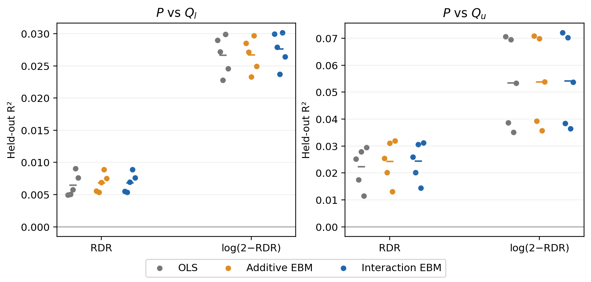
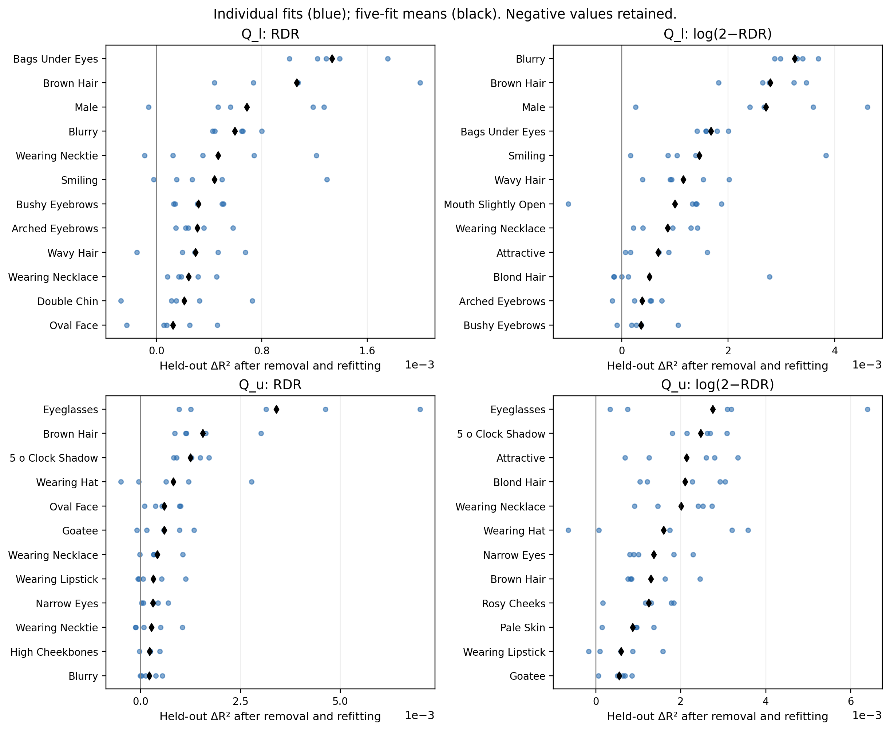
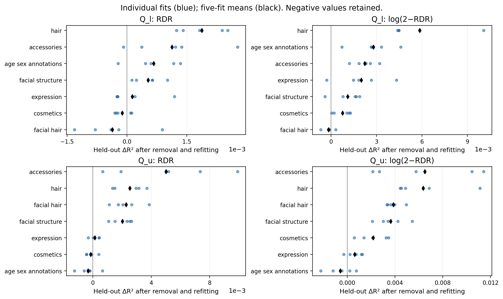

# CelebA attribute interactions and response sensitivity

**Complete: 20 scenarios (two pairs × two responses × five frozen RDR fits), 980 EBM fits and 20 OLS fits.**

These are post hoc attribute explanation models. No RDR network is trained or changed. The same 39,829 real images with 40 binary attributes are divided by identity into training, early-stopping and assessment sets. One common fixed split is used across all scenarios; this is a held-out comparison, not cross-validation. The underlying pool was historically inspected, so this remains exploratory rather than fresh confirmatory evidence.

| Surrogate role | Images | Identities |
| --- | --- | --- |
| train | 23805 | 1191 |
| val | 7902 | 397 |
| test | 8122 | 397 |

## Methods

Compare train-only OLS, an additive EBM, and an EBM with 10 automatically selected pairwise interactions. EBM early stopping uses only the reserved validation identities through explicit bag assignments; assessment rows never enter fit. Each target is centered/scaled using training rows only, then predictions are returned to the original scale. RDR uses the saved bounded scores; log(2−RDR) uses the previously recovered stable logits, retaining all saturated observations. EBM predictions are not clipped. The fixed EBM specification is in protocol.json, using InterpretML 0.7.8.

Remove each of 40 attributes and each of seven predefined semantic groups, then refit the interaction EBM with the same split, settings and early-stopping rule. Interaction selection is repeated using the remaining predictors. Importance is held-out ΔR² = R²(full) − R²(reduced), equivalently the increase in MSE divided by assessment response variance. Positive values mean removal worsens prediction; negative values mean the reduced model predicts better. These are algorithm-dependent incremental predictive contributions, not causal effects or additive shares of total divergence. Grouped deletion captures shared information, but does not remove all dependence between retained and omitted annotations.

The seven groups are prespecified in protocol.json and are not a partition of all 40 attributes. The 10 fitted interaction terms are descriptive model components; their training magnitudes in terms_per_fit.csv are not held-out deletion importance. Five-fit SD and plotted dots reflect variation across frozen RDR targets on the same data. They are not confidence intervals. Rankings are assessment diagnostics, not a new selected model. No assessment-based tuning or best-repeat selection occurs.

## Held-out accuracy

| Pair | Response | OLS R² mean (SD) | Additive EBM | Interaction EBM |
| --- | --- | --- | --- | --- |
| Q_l | rdr | 0.0065 (0.0018) | 0.0068 (0.0015) | 0.0069 (0.0015) |
| Q_l | log_complement | 0.0267 (0.0030) | 0.0267 (0.0026) | 0.0276 (0.0027) |
| Q_u | rdr | 0.0223 (0.0076) | 0.0243 (0.0079) | 0.0244 (0.0072) |
| Q_u | log_complement | 0.0534 (0.0166) | 0.0539 (0.0165) | 0.0542 (0.0169) |

[PDF](../attribute_interaction_figures_20261003/predictive_accuracy.pdf)

R² uses the variance of the same assessment response. Negative R² means worse than its assessment-mean reference; the independently fitted training-mean baseline is also included in metrics_per_fit.csv. Compare R² within each response and use rankings to assess response sensitivity; raw MSE values across responses are not comparable.

## Attribute and group importance

[PDF](../attribute_interaction_figures_20261003/attribute_importance.pdf)

[PDF](../attribute_interaction_figures_20261003/group_importance.pdf)

### lower / rdr

| Attribute | Mean ΔR² | SD | Positive repeats / 5 |
| --- | --- | --- | --- |
| Bags_Under_Eyes | 0.00133 | 0.00027 | 5 |
| Brown_Hair | 0.00106 | 0.00059 | 5 |
| Male | 0.00069 | 0.00055 | 4 |
| Blurry | 0.00059 | 0.00016 | 5 |
| Wearing_Necktie | 0.00047 | 0.00052 | 4 |
| Smiling | 0.00044 | 0.00051 | 4 |
| Bushy_Eyebrows | 0.00032 | 0.00018 | 5 |
| Arched_Eyebrows | 0.00031 | 0.00017 | 5 |
| Wavy_Hair | 0.00030 | 0.00031 | 4 |
| Wearing_Necklace | 0.00024 | 0.00015 | 5 |

### lower / log_complement

| Attribute | Mean ΔR² | SD | Positive repeats / 5 |
| --- | --- | --- | --- |
| Blurry | 0.00325 | 0.00033 | 5 |
| Brown_Hair | 0.00279 | 0.00064 | 5 |
| Male | 0.00271 | 0.00162 | 5 |
| Bags_Under_Eyes | 0.00168 | 0.00023 | 5 |
| Smiling | 0.00146 | 0.00140 | 5 |
| Wavy_Hair | 0.00116 | 0.00063 | 5 |
| Mouth_Slightly_Open | 0.00100 | 0.00114 | 4 |
| Wearing_Necklace | 0.00086 | 0.00053 | 5 |
| Attractive | 0.00068 | 0.00062 | 5 |
| Blond_Hair | 0.00052 | 0.00126 | 3 |

### upper / rdr

| Attribute | Mean ΔR² | SD | Positive repeats / 5 |
| --- | --- | --- | --- |
| Eyeglasses | 0.00340 | 0.00250 | 5 |
| Brown_Hair | 0.00155 | 0.00086 | 5 |
| 5_o_Clock_Shadow | 0.00124 | 0.00038 | 5 |
| Wearing_Hat | 0.00081 | 0.00127 | 3 |
| Oval_Face | 0.00059 | 0.00039 | 5 |
| Goatee | 0.00059 | 0.00058 | 4 |
| Wearing_Necklace | 0.00042 | 0.00039 | 4 |
| Wearing_Lipstick | 0.00032 | 0.00051 | 3 |
| Narrow_Eyes | 0.00031 | 0.00027 | 5 |
| Wearing_Necktie | 0.00027 | 0.00050 | 3 |

### upper / log_complement

| Attribute | Mean ΔR² | SD | Positive repeats / 5 |
| --- | --- | --- | --- |
| Eyeglasses | 0.00275 | 0.00242 | 5 |
| 5_o_Clock_Shadow | 0.00247 | 0.00050 | 5 |
| Attractive | 0.00214 | 0.00112 | 5 |
| Blond_Hair | 0.00210 | 0.00094 | 5 |
| Wearing_Necklace | 0.00201 | 0.00078 | 5 |
| Wearing_Hat | 0.00159 | 0.00186 | 4 |
| Narrow_Eyes | 0.00136 | 0.00066 | 5 |
| Brown_Hair | 0.00130 | 0.00074 | 5 |
| Rosy_Cheeks | 0.00125 | 0.00067 | 5 |
| Pale_Skin | 0.00086 | 0.00044 | 5 |

## Response-ranking agreement

| Pair | Type | Spearman correlation | Top-five overlap |
| --- | --- | --- | --- |
| lower | attribute | 0.570 | 4/5 |
| lower | group | 0.929 | 5/5 |
| upper | attribute | 0.643 | 2/5 |
| upper | group | 0.964 | 4/5 |

[Accuracy table](metrics_summary.csv) · [All importance rankings](importance_summary.csv) · [Per-fit importances](importance_per_fit.csv) · [Response stability](response_stability.csv) · [Interaction components](terms_per_fit.csv)

All per-task held-out predictions, the two EBM models, split membership, parent hashes, installed-environment hashes and frozen source remain in the HPC archive. The report, aggregate/per-fit tables, plots and reproducible source are suitable for compact repository export. Predictors are CelebA annotations on real images only; generated-only regions and unannotated visual properties are not explained. Attribute labels are measured annotations, not inferred causal mechanisms.

Implementation reference: [InterpretML EBM API](https://interpret.ml/docs/python/api/ExplainableBoostingRegressor.html).
