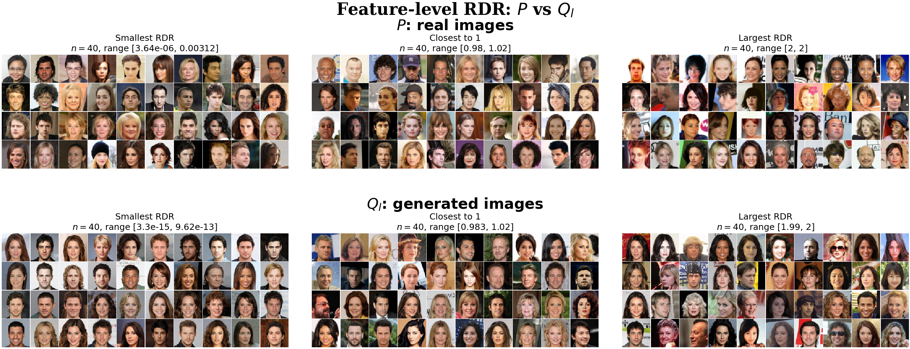
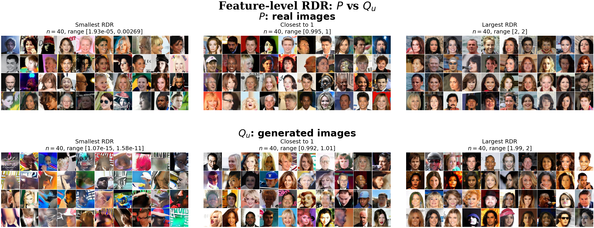
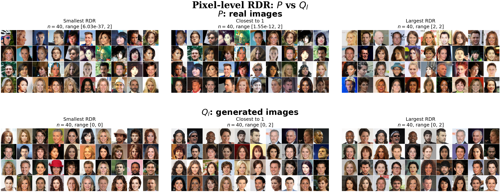
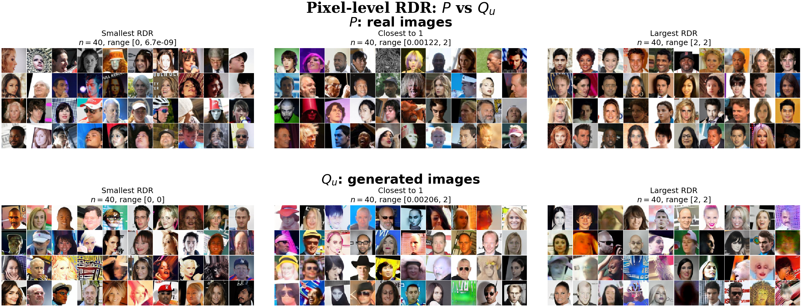

# CelebA: one merged held-out test pool

**Complete: 20 selected-model and 25 null assessments; no retraining or model selection.**

Former final-calibration rows followed by final-evaluation rows form one test pool. The identical observations supply cell-count C.1/C.2 intervals, neural means, Brier, Gap and example images. Main counts: 39,829 P and 40,000 per Q; generated null counts: 20,000 per A/B; real null counts: 19,911 A and 19,918 B.

Test rows are disjoint from training and development rows. Historically inspected design/test observations still make this a retrospective held-out analysis, not a new untouched prospective study. Networks, configurations and the 20 score bins remain fixed.

## Main comparisons

Mean (SD) over five training repetitions on the same merged test pool.

| Comparison | brier | local_gap | supported_mass | middle_mass | middle_local_gap |
| --- | --- | --- | --- | --- | --- |
| feature / lower | 0.021975 (0.000525) | 0.020121 (0.006135) | 1.000000 (0.000000) | 0.011990 (0.001986) | 0.091841 (0.044275) |
| feature / upper | 0.052279 (0.000514) | 0.023471 (0.004319) | 1.000000 (0.000000) | 0.042108 (0.003378) | 0.072416 (0.029584) |
| pixel / lower | 0.000235 (0.000116) | 0.000488 (0.000256) | 1.000000 (0.000000) | 0.000010 (0.000016) | Unavailable (not all repeats) |
| pixel / upper | 0.003508 (0.000907) | 0.005365 (0.001821) | 1.000000 (0.000000) | 0.001117 (0.000965) | 0.249355 (0.073954) |

## Learned null controls

| Comparison | brier | local_gap | rdr_mse_one | rdr_rmse_one |
| --- | --- | --- | --- | --- |
| feature / lower | 0.250066 (0.000040) | 0.010761 (0.005583) | 0.000151 (0.000075) | 0.011943 (0.003170) |
| feature / upper | 0.250042 (0.000060) | 0.010976 (0.007402) | 0.000239 (0.000142) | 0.014885 (0.004671) |
| pixel / lower | 0.250233 (0.000194) | 0.020732 (0.010600) | 0.001052 (0.000611) | 0.031366 (0.009257) |
| pixel / upper | 0.250665 (0.000330) | 0.040803 (0.010957) | 0.003073 (0.000961) | 0.054789 (0.009454) |
| pixel / real | 0.251061 (0.000275) | 0.053309 (0.005364) | 0.004487 (0.000707) | 0.066820 (0.005253) |

Supported mass is 1 by construction: every occupied evaluation cell uses those same observations for its cell-count estimate. This is not separate evidence of calibration. Local Gap uses two correlated estimates on the same pool; the cell CIs are not CIs for their difference. C.1/C.2 target cell-average population RDR, not an individual image or the estimated neural mean. Intervals remain nominal image-level diagnostics, without within-identity dependence adjustment; C.2 simultaneity is within one comparison. Repetition SD measures training variation, not data-resampling uncertainty.

## Publication image panels

Repeat 00 is fixed, not selected for appearance or performance. For each source separately, choose 40 globally smallest RDRs, 40 nearest to 1, and 40 largest RDRs, with seeded tie breaking. There are no preset broad score intervals; panel labels give the actual displayed minimum and maximum (three significant digits). Groups are selected independently, so overlap is possible. No images or scores are generated or altered. Examples do not represent prevalence.

[PDF](../publication_figures_20261003_v2/images_feature_lower_ranked.pdf)

[PDF](../publication_figures_20261003_v2/images_feature_upper_ranked.pdf)

[PDF](../publication_figures_20261003_v2/images_pixel_lower_ranked.pdf)

[PDF](../publication_figures_20261003_v2/images_pixel_upper_ranked.pdf)

## All figures

- [ci_feature_repeat_00 PNG](figures/ci_feature_repeat_00.png) · [PDF](figures/ci_feature_repeat_00.pdf)
- [ci_feature_repeat_01 PNG](figures/ci_feature_repeat_01.png) · [PDF](figures/ci_feature_repeat_01.pdf)
- [ci_feature_repeat_02 PNG](figures/ci_feature_repeat_02.png) · [PDF](figures/ci_feature_repeat_02.pdf)
- [ci_feature_repeat_03 PNG](figures/ci_feature_repeat_03.png) · [PDF](figures/ci_feature_repeat_03.pdf)
- [ci_feature_repeat_04 PNG](figures/ci_feature_repeat_04.png) · [PDF](figures/ci_feature_repeat_04.pdf)
- [ci_pixel_repeat_00 PNG](figures/ci_pixel_repeat_00.png) · [PDF](figures/ci_pixel_repeat_00.pdf)
- [ci_pixel_repeat_01 PNG](figures/ci_pixel_repeat_01.png) · [PDF](figures/ci_pixel_repeat_01.pdf)
- [ci_pixel_repeat_02 PNG](figures/ci_pixel_repeat_02.png) · [PDF](figures/ci_pixel_repeat_02.pdf)
- [ci_pixel_repeat_03 PNG](figures/ci_pixel_repeat_03.png) · [PDF](figures/ci_pixel_repeat_03.pdf)
- [ci_pixel_repeat_04 PNG](figures/ci_pixel_repeat_04.png) · [PDF](figures/ci_pixel_repeat_04.pdf)
- [images_feature_lower_ranked PNG](../publication_figures_20261003_v2/images_feature_lower_ranked.png) · [PDF](../publication_figures_20261003_v2/images_feature_lower_ranked.pdf)
- [images_feature_lower_all_bins PNG](figures/images_feature_lower_all_bins.png) · [PDF](figures/images_feature_lower_all_bins.pdf)
- [images_feature_upper_ranked PNG](../publication_figures_20261003_v2/images_feature_upper_ranked.png) · [PDF](../publication_figures_20261003_v2/images_feature_upper_ranked.pdf)
- [images_feature_upper_all_bins PNG](figures/images_feature_upper_all_bins.png) · [PDF](figures/images_feature_upper_all_bins.pdf)
- [images_pixel_lower_ranked PNG](../publication_figures_20261003_v2/images_pixel_lower_ranked.png) · [PDF](../publication_figures_20261003_v2/images_pixel_lower_ranked.pdf)
- [images_pixel_lower_all_bins PNG](figures/images_pixel_lower_all_bins.png) · [PDF](figures/images_pixel_lower_all_bins.pdf)
- [images_pixel_upper_ranked PNG](../publication_figures_20261003_v2/images_pixel_upper_ranked.png) · [PDF](../publication_figures_20261003_v2/images_pixel_upper_ranked.pdf)
- [images_pixel_upper_all_bins PNG](figures/images_pixel_upper_all_bins.png) · [PDF](figures/images_pixel_upper_all_bins.pdf)
- [null_summary PNG](figures/null_summary.png) · [PDF](figures/null_summary.pdf)
- [null_ci_repeat_00 PNG](figures/null_ci_repeat_00.png) · [PDF](figures/null_ci_repeat_00.pdf)

[Main per-fit metrics](main_per_fit.csv) · [Main aggregates](main_per_comparison.csv) · [Null per-fit metrics](null_per_fit.csv) · [Null aggregates](null_per_comparison.csv)
[All 900 cell records](cell_intervals.csv) · [Image IDs and scores](selected_images.csv) · [Group ranges and counts](image_groups.csv) · [Protocol](protocol.json)
