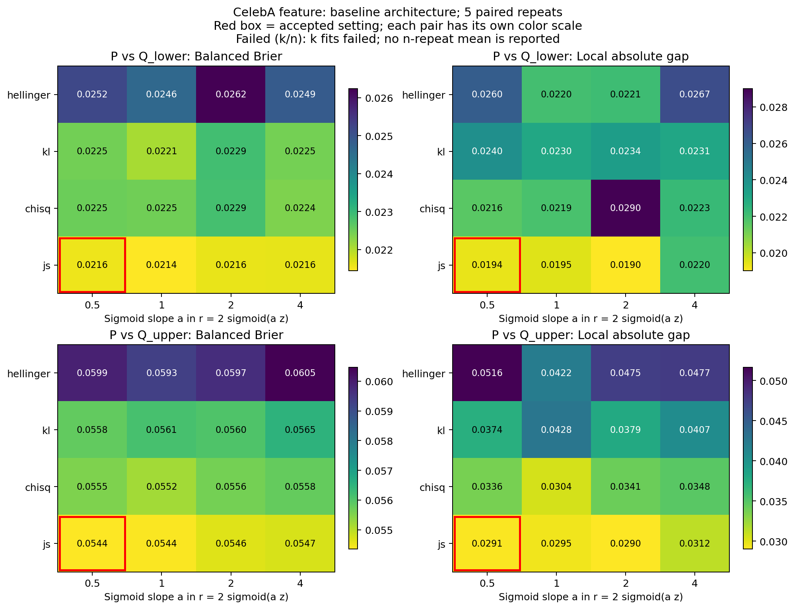
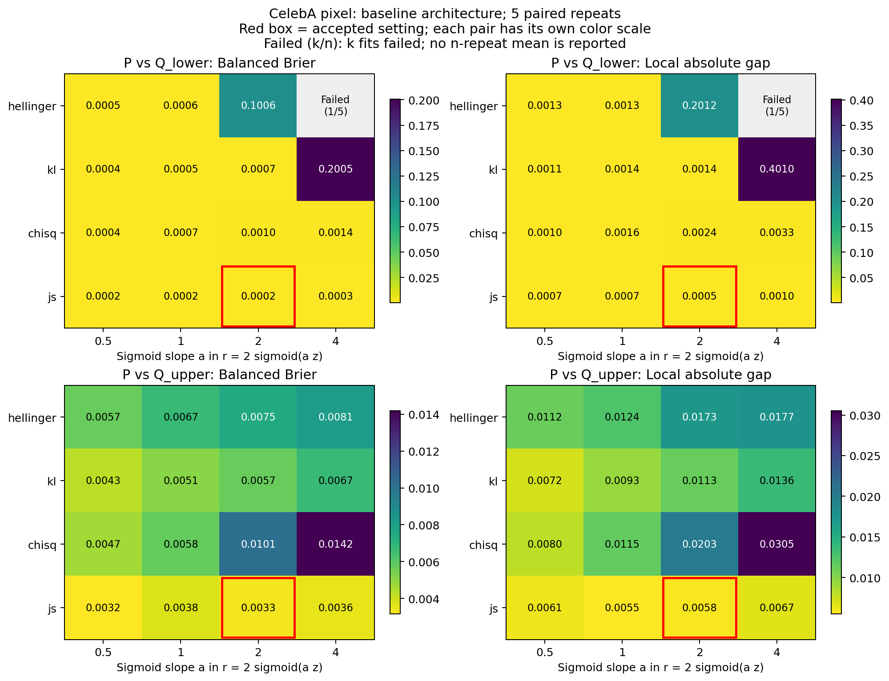

# CelebA expanded-data loss and activation selection

**Status: incomplete; 319/320 verified fits.**

Fixed baseline architectures; four losses, four sigmoid slopes, five paired repetitions. Separate selections for both P/Q pairs and both representations. The output is r=2 sigmoid(alpha z).

Checkpoints minimize stopping-set balanced Brier. Selection uses the paired one-SE Brier shortlist, then minimum supported local absolute Gap, with at least 0.99 supported mass in every repetition. Calibration and evaluation rows for selection are separate. P and Q each have weight one half.

Hellinger backward uses an algebraic exponential scale factor and float64 gradient norms. The factor is accounted for during gradient clipping; the objective and ratio parameterization are unchanged, with no ratio clipping.

Architecture sensitivity and final calibration/evaluation are outside this run. Final image/feature arrays remain unopened by this model-selection workflow.

## Accepted settings

| Representation / pair | Loss | Sigmoid slope |
| --- | --- | --- |
| feature / lower | js | 0.5 |
| feature / upper | js | 0.5 |
| pixel / lower | js | 2 |
| pixel / upper | js | 2 |

These settings were accepted by the user for final assessment after reviewing the Brier-shortlist/local-Gap recommendations. The pixel/lower recommendation excluded the incomplete Hellinger/slope-4 candidate. Acceptance does not mark the 319/320 selection grid complete.

[Separate final assessment](../merged_test_20261003/RESULTS.md).

## Failed fits and figure caption

“Failed (k/n)” denotes k failed fits among n planned repetitions. The five-repeat aggregate is omitted; successful repetitions are retained, but are not averaged as if the candidate had completed. This is not a running or pending experiment.

- pixel / P versus Q_lower, hellinger, sigmoid slope 4, repeat 03: `FloatingPointError: Nonfinite objective at epoch 7`.

The recorded failure is numerical: the training objective became nonfinite (NaN or infinity), triggering the explicit finite-value check. The Hellinger objective contains inverse-square-root ratio terms, which can become very large when predicted RDR approaches zero. Gradient scaling does not guarantee a finite forward objective. The saved log does not establish the exact intermediate quantity that first became nonfinite, so this mechanism is an explanation of the risk, not a confirmed root-cause trace.

**Paper caption:** Validation model comparison over four losses and four sigmoid slopes, using five paired training repetitions for each P/Q pair and representation. Cells show mean balanced Brier or supported local absolute Gap. Red boxes indicate the accepted settings. For pixel P versus Q_l with Hellinger loss and slope 4, one of five fits terminated at epoch 7 because the training objective was nonfinite; the aggregate is therefore marked Failed (1/5).

## Exact split counts

| Role | Historical source / use | P images | P identities | Q_lower images | Q_upper images |
| --- | --- | --- | --- | --- | --- |
| earlystop | Half expanded validation; checkpoint selection only | 19898 | 1023 | 20000 | 20000 |
| selection_calibration | Quarter expanded validation; cell RDR estimates | 9935 | 511 | 10000 | 10000 |
| selection_evaluation | Quarter expanded validation; candidate Brier and local Gap | 9953 | 500 | 10000 | 10000 |
| test_calibration | Reserved half of expanded final pool; not loaded for model selection | 19906 | 989 | 20000 | 20000 |
| test_evaluation | Reserved other half of expanded final pool; not loaded for model selection | 19923 | 996 | 20000 | 20000 |
| train | Full historical training pools | 122984 | 6158 | 120000 | 120000 |

## Validation results

Entries show mean (SD) over the five registered repetitions. Incomplete candidates are not averaged over fewer runs.

| Representation / pair | Candidate | Repeats | Balanced Brier | Local absolute gap | Supported mass |
| --- | --- | --- | --- | --- | --- |
| feature / P vs Q_lower | `baseline_chisq_a0p5` | 5/5 | 0.022512 (0.000214) | 0.021576 (0.004959) | 1.000000 (0.000000) |
| feature / P vs Q_lower | `baseline_chisq_a1` | 5/5 | 0.022472 (0.000376) | 0.021874 (0.006704) | 1.000000 (0.000000) |
| feature / P vs Q_lower | `baseline_chisq_a2` | 5/5 | 0.022850 (0.000324) | 0.028992 (0.003653) | 1.000000 (0.000000) |
| feature / P vs Q_lower | `baseline_chisq_a4` | 5/5 | 0.022364 (0.000320) | 0.022278 (0.005923) | 1.000000 (0.000000) |
| feature / P vs Q_lower | `baseline_hellinger_a0p5` | 5/5 | 0.025196 (0.000835) | 0.026035 (0.003699) | 1.000000 (0.000000) |
| feature / P vs Q_lower | `baseline_hellinger_a1` | 5/5 | 0.024613 (0.000824) | 0.021996 (0.006743) | 1.000000 (0.000000) |
| feature / P vs Q_lower | `baseline_hellinger_a2` | 5/5 | 0.026233 (0.001012) | 0.022123 (0.004174) | 1.000000 (0.000000) |
| feature / P vs Q_lower | `baseline_hellinger_a4` | 5/5 | 0.024867 (0.000974) | 0.026651 (0.006291) | 1.000000 (0.000000) |
| feature / P vs Q_lower | `baseline_js_a0p5` | 5/5 | 0.021556 (0.000744) | 0.019357 (0.005544) | 1.000000 (0.000000) |
| feature / P vs Q_lower | `baseline_js_a1` | 5/5 | 0.021441 (0.000762) | 0.019499 (0.005946) | 1.000000 (0.000000) |
| feature / P vs Q_lower | `baseline_js_a2` | 5/5 | 0.021606 (0.000678) | 0.019019 (0.005398) | 1.000000 (0.000000) |
| feature / P vs Q_lower | `baseline_js_a4` | 5/5 | 0.021614 (0.000655) | 0.022037 (0.008558) | 1.000000 (0.000000) |
| feature / P vs Q_lower | `baseline_kl_a0p5` | 5/5 | 0.022462 (0.000738) | 0.024015 (0.005485) | 1.000000 (0.000000) |
| feature / P vs Q_lower | `baseline_kl_a1` | 5/5 | 0.022065 (0.000603) | 0.022995 (0.004695) | 1.000000 (0.000000) |
| feature / P vs Q_lower | `baseline_kl_a2` | 5/5 | 0.022901 (0.000352) | 0.023439 (0.008186) | 1.000000 (0.000000) |
| feature / P vs Q_lower | `baseline_kl_a4` | 5/5 | 0.022451 (0.000824) | 0.023096 (0.003824) | 1.000000 (0.000000) |
| feature / P vs Q_upper | `baseline_chisq_a0p5` | 5/5 | 0.055527 (0.001147) | 0.033610 (0.012621) | 1.000000 (0.000000) |
| feature / P vs Q_upper | `baseline_chisq_a1` | 5/5 | 0.055208 (0.000879) | 0.030445 (0.014336) | 1.000000 (0.000000) |
| feature / P vs Q_upper | `baseline_chisq_a2` | 5/5 | 0.055617 (0.000901) | 0.034126 (0.010886) | 1.000000 (0.000000) |
| feature / P vs Q_upper | `baseline_chisq_a4` | 5/5 | 0.055788 (0.000971) | 0.034760 (0.013573) | 1.000000 (0.000000) |
| feature / P vs Q_upper | `baseline_hellinger_a0p5` | 5/5 | 0.059899 (0.000232) | 0.051645 (0.006463) | 1.000000 (0.000000) |
| feature / P vs Q_upper | `baseline_hellinger_a1` | 5/5 | 0.059297 (0.001147) | 0.042158 (0.007443) | 1.000000 (0.000000) |
| feature / P vs Q_upper | `baseline_hellinger_a2` | 5/5 | 0.059676 (0.001042) | 0.047485 (0.004710) | 1.000000 (0.000000) |
| feature / P vs Q_upper | `baseline_hellinger_a4` | 5/5 | 0.060468 (0.000388) | 0.047685 (0.013041) | 1.000000 (0.000000) |
| feature / P vs Q_upper | `baseline_js_a0p5` | 5/5 | 0.054351 (0.000666) | 0.029111 (0.003247) | 1.000000 (0.000000) |
| feature / P vs Q_upper | `baseline_js_a1` | 5/5 | 0.054379 (0.000762) | 0.029510 (0.011686) | 1.000000 (0.000000) |
| feature / P vs Q_upper | `baseline_js_a2` | 5/5 | 0.054639 (0.000721) | 0.029006 (0.007464) | 1.000000 (0.000000) |
| feature / P vs Q_upper | `baseline_js_a4` | 5/5 | 0.054709 (0.000792) | 0.031234 (0.011757) | 1.000000 (0.000000) |
| feature / P vs Q_upper | `baseline_kl_a0p5` | 5/5 | 0.055812 (0.000602) | 0.037381 (0.012041) | 1.000000 (0.000000) |
| feature / P vs Q_upper | `baseline_kl_a1` | 5/5 | 0.056129 (0.001556) | 0.042787 (0.016193) | 1.000000 (0.000000) |
| feature / P vs Q_upper | `baseline_kl_a2` | 5/5 | 0.056024 (0.000883) | 0.037907 (0.012739) | 1.000000 (0.000000) |
| feature / P vs Q_upper | `baseline_kl_a4` | 5/5 | 0.056509 (0.000864) | 0.040663 (0.013021) | 1.000000 (0.000000) |
| pixel / P vs Q_lower | `baseline_chisq_a0p5` | 5/5 | 0.000425 (0.000153) | 0.001009 (0.000344) | 0.999800 (0.000112) |
| pixel / P vs Q_lower | `baseline_chisq_a1` | 5/5 | 0.000687 (0.000213) | 0.001591 (0.000447) | 0.999749 (0.000158) |
| pixel / P vs Q_lower | `baseline_chisq_a2` | 5/5 | 0.001027 (0.000406) | 0.002356 (0.000592) | 0.999840 (0.000089) |
| pixel / P vs Q_lower | `baseline_chisq_a4` | 5/5 | 0.001400 (0.000715) | 0.003308 (0.000872) | 0.999830 (0.000183) |
| pixel / P vs Q_lower | `baseline_hellinger_a0p5` | 5/5 | 0.000518 (0.000247) | 0.001292 (0.000289) | 0.999850 (0.000133) |
| pixel / P vs Q_lower | `baseline_hellinger_a1` | 5/5 | 0.000639 (0.000210) | 0.001267 (0.000448) | 0.999850 (0.000142) |
| pixel / P vs Q_lower | `baseline_hellinger_a2` | 5/5 | 0.100584 (0.223280) | 0.201195 (0.446546) | 0.999920 (0.000130) |
| pixel / P vs Q_lower | `baseline_hellinger_a4` | 4/5 | Unavailable (4/5) | Unavailable (4/5) | Unavailable (4/5) |
| pixel / P vs Q_lower | `baseline_js_a0p5` | 5/5 | 0.000183 (0.000018) | 0.000688 (0.000215) | 0.999849 (0.000094) |
| pixel / P vs Q_lower | `baseline_js_a1` | 5/5 | 0.000205 (0.000074) | 0.000686 (0.000341) | 0.999890 (0.000125) |
| pixel / P vs Q_lower | `baseline_js_a2` | 5/5 | 0.000159 (0.000052) | 0.000519 (0.000238) | 0.999940 (0.000083) |
| pixel / P vs Q_lower | `baseline_js_a4` | 5/5 | 0.000326 (0.000157) | 0.000958 (0.000343) | 0.999859 (0.000182) |
| pixel / P vs Q_lower | `baseline_kl_a0p5` | 5/5 | 0.000437 (0.000120) | 0.001085 (0.000181) | 0.999850 (0.000079) |
| pixel / P vs Q_lower | `baseline_kl_a1` | 5/5 | 0.000543 (0.000213) | 0.001443 (0.000211) | 0.999950 (0.000035) |
| pixel / P vs Q_lower | `baseline_kl_a2` | 5/5 | 0.000684 (0.000126) | 0.001384 (0.000548) | 0.999880 (0.000130) |
| pixel / P vs Q_lower | `baseline_kl_a4` | 5/5 | 0.200452 (0.273448) | 0.400980 (0.546828) | 0.999970 (0.000067) |
| pixel / P vs Q_upper | `baseline_chisq_a0p5` | 5/5 | 0.004690 (0.000181) | 0.007955 (0.001281) | 1.000000 (0.000000) |
| pixel / P vs Q_upper | `baseline_chisq_a1` | 5/5 | 0.005764 (0.000510) | 0.011503 (0.001650) | 0.999930 (0.000157) |
| pixel / P vs Q_upper | `baseline_chisq_a2` | 5/5 | 0.010144 (0.000877) | 0.020258 (0.001603) | 0.999870 (0.000264) |
| pixel / P vs Q_upper | `baseline_chisq_a4` | 5/5 | 0.014195 (0.001163) | 0.030533 (0.002521) | 0.999669 (0.000203) |
| pixel / P vs Q_upper | `baseline_hellinger_a0p5` | 5/5 | 0.005702 (0.000768) | 0.011226 (0.001439) | 0.999880 (0.000179) |
| pixel / P vs Q_upper | `baseline_hellinger_a1` | 5/5 | 0.006725 (0.000743) | 0.012415 (0.001284) | 0.999890 (0.000195) |
| pixel / P vs Q_upper | `baseline_hellinger_a2` | 5/5 | 0.007477 (0.000736) | 0.017310 (0.000500) | 0.999790 (0.000205) |
| pixel / P vs Q_upper | `baseline_hellinger_a4` | 5/5 | 0.008073 (0.000670) | 0.017732 (0.000913) | 0.999900 (0.000094) |
| pixel / P vs Q_upper | `baseline_js_a0p5` | 5/5 | 0.003153 (0.000355) | 0.006122 (0.000847) | 0.999960 (0.000089) |
| pixel / P vs Q_upper | `baseline_js_a1` | 5/5 | 0.003776 (0.000507) | 0.005509 (0.001681) | 0.999980 (0.000045) |
| pixel / P vs Q_upper | `baseline_js_a2` | 5/5 | 0.003331 (0.000937) | 0.005763 (0.001533) | 0.999840 (0.000231) |
| pixel / P vs Q_upper | `baseline_js_a4` | 5/5 | 0.003559 (0.000844) | 0.006731 (0.000841) | 0.999910 (0.000135) |
| pixel / P vs Q_upper | `baseline_kl_a0p5` | 5/5 | 0.004260 (0.000152) | 0.007212 (0.001385) | 0.999990 (0.000022) |
| pixel / P vs Q_upper | `baseline_kl_a1` | 5/5 | 0.005121 (0.000417) | 0.009339 (0.001632) | 1.000000 (0.000000) |
| pixel / P vs Q_upper | `baseline_kl_a2` | 5/5 | 0.005703 (0.000194) | 0.011308 (0.001423) | 0.999940 (0.000134) |
| pixel / P vs Q_upper | `baseline_kl_a4` | 5/5 | 0.006707 (0.000415) | 0.013588 (0.001366) | 0.999629 (0.000169) |

| Representation / pair | Candidate | Repeats | Middle mass | Middle supported fraction | Middle local gap |
| --- | --- | --- | --- | --- | --- |
| feature / P vs Q_lower | `baseline_chisq_a0p5` | 5/5 | 0.011646 (0.001494) | 1.000000 (0.000000) | 0.128601 (0.039247) |
| feature / P vs Q_lower | `baseline_chisq_a1` | 5/5 | 0.011354 (0.003060) | 1.000000 (0.000000) | 0.155080 (0.066412) |
| feature / P vs Q_lower | `baseline_chisq_a2` | 5/5 | 0.009402 (0.001350) | 1.000000 (0.000000) | 0.208186 (0.039643) |
| feature / P vs Q_lower | `baseline_chisq_a4` | 5/5 | 0.011117 (0.003198) | 1.000000 (0.000000) | 0.159890 (0.064549) |
| feature / P vs Q_lower | `baseline_hellinger_a0p5` | 5/5 | 0.012627 (0.003303) | 1.000000 (0.000000) | 0.144014 (0.052850) |
| feature / P vs Q_lower | `baseline_hellinger_a1` | 5/5 | 0.014372 (0.003530) | 1.000000 (0.000000) | 0.115132 (0.021901) |
| feature / P vs Q_lower | `baseline_hellinger_a2` | 5/5 | 0.017290 (0.003361) | 1.000000 (0.000000) | 0.131394 (0.067000) |
| feature / P vs Q_lower | `baseline_hellinger_a4` | 5/5 | 0.013209 (0.003582) | 1.000000 (0.000000) | 0.145271 (0.062258) |
| feature / P vs Q_lower | `baseline_js_a0p5` | 5/5 | 0.011716 (0.001972) | 1.000000 (0.000000) | 0.167031 (0.051070) |
| feature / P vs Q_lower | `baseline_js_a1` | 5/5 | 0.011557 (0.002363) | 1.000000 (0.000000) | 0.122420 (0.045428) |
| feature / P vs Q_lower | `baseline_js_a2` | 5/5 | 0.012731 (0.001709) | 1.000000 (0.000000) | 0.141454 (0.044530) |
| feature / P vs Q_lower | `baseline_js_a4` | 5/5 | 0.010565 (0.003257) | 1.000000 (0.000000) | 0.109946 (0.036187) |
| feature / P vs Q_lower | `baseline_kl_a0p5` | 5/5 | 0.010434 (0.003775) | 1.000000 (0.000000) | 0.177010 (0.028755) |
| feature / P vs Q_lower | `baseline_kl_a1` | 5/5 | 0.011204 (0.002332) | 1.000000 (0.000000) | 0.101996 (0.041063) |
| feature / P vs Q_lower | `baseline_kl_a2` | 5/5 | 0.011775 (0.004561) | 1.000000 (0.000000) | 0.153462 (0.053097) |
| feature / P vs Q_lower | `baseline_kl_a4` | 5/5 | 0.011667 (0.002389) | 1.000000 (0.000000) | 0.131431 (0.040552) |
| feature / P vs Q_upper | `baseline_chisq_a0p5` | 5/5 | 0.037674 (0.005161) | 1.000000 (0.000000) | 0.083547 (0.021641) |
| feature / P vs Q_upper | `baseline_chisq_a1` | 5/5 | 0.037354 (0.004393) | 1.000000 (0.000000) | 0.079848 (0.021590) |
| feature / P vs Q_upper | `baseline_chisq_a2` | 5/5 | 0.036502 (0.004102) | 1.000000 (0.000000) | 0.080237 (0.012530) |
| feature / P vs Q_upper | `baseline_chisq_a4` | 5/5 | 0.037353 (0.005387) | 1.000000 (0.000000) | 0.075418 (0.018835) |
| feature / P vs Q_upper | `baseline_hellinger_a0p5` | 5/5 | 0.034050 (0.005170) | 1.000000 (0.000000) | 0.089570 (0.040568) |
| feature / P vs Q_upper | `baseline_hellinger_a1` | 5/5 | 0.036369 (0.011418) | 1.000000 (0.000000) | 0.105435 (0.077157) |
| feature / P vs Q_upper | `baseline_hellinger_a2` | 5/5 | 0.039940 (0.006856) | 1.000000 (0.000000) | 0.084889 (0.020600) |
| feature / P vs Q_upper | `baseline_hellinger_a4` | 5/5 | 0.043058 (0.009540) | 1.000000 (0.000000) | 0.104026 (0.050483) |
| feature / P vs Q_upper | `baseline_js_a0p5` | 5/5 | 0.041670 (0.003687) | 1.000000 (0.000000) | 0.111101 (0.021363) |
| feature / P vs Q_upper | `baseline_js_a1` | 5/5 | 0.041350 (0.005056) | 1.000000 (0.000000) | 0.089244 (0.038548) |
| feature / P vs Q_upper | `baseline_js_a2` | 5/5 | 0.040226 (0.005021) | 1.000000 (0.000000) | 0.107526 (0.028643) |
| feature / P vs Q_upper | `baseline_js_a4` | 5/5 | 0.038390 (0.005668) | 1.000000 (0.000000) | 0.079883 (0.036312) |
| feature / P vs Q_upper | `baseline_kl_a0p5` | 5/5 | 0.036565 (0.007614) | 1.000000 (0.000000) | 0.096830 (0.016312) |
| feature / P vs Q_upper | `baseline_kl_a1` | 5/5 | 0.035047 (0.009933) | 1.000000 (0.000000) | 0.084817 (0.031130) |
| feature / P vs Q_upper | `baseline_kl_a2` | 5/5 | 0.038702 (0.005641) | 1.000000 (0.000000) | 0.106632 (0.036305) |
| feature / P vs Q_upper | `baseline_kl_a4` | 5/5 | 0.035630 (0.005801) | 1.000000 (0.000000) | 0.087288 (0.015093) |
| pixel / P vs Q_lower | `baseline_chisq_a0p5` | 5/5 | 0.000100 (0.000079) | Unavailable (4/5) | Unavailable (3/5) |
| pixel / P vs Q_lower | `baseline_chisq_a1` | 5/5 | 0.000170 (0.000186) | 0.659943 (0.421877) | Unavailable (4/5) |
| pixel / P vs Q_lower | `baseline_chisq_a2` | 5/5 | 0.000050 (0.000050) | Unavailable (3/5) | Unavailable (1/5) |
| pixel / P vs Q_lower | `baseline_chisq_a4` | 5/5 | 0.000100 (0.000094) | Unavailable (4/5) | Unavailable (2/5) |
| pixel / P vs Q_lower | `baseline_hellinger_a0p5` | 5/5 | 0.000060 (0.000065) | Unavailable (3/5) | Unavailable (1/5) |
| pixel / P vs Q_lower | `baseline_hellinger_a1` | 5/5 | 0.000060 (0.000082) | Unavailable (2/5) | Unavailable (2/5) |
| pixel / P vs Q_lower | `baseline_hellinger_a2` | 5/5 | 0.000010 (0.000022) | Unavailable (1/5) | Unavailable (0/5) |
| pixel / P vs Q_lower | `baseline_hellinger_a4` | 4/5 | Unavailable (4/5) | Unavailable (0/5) | Unavailable (0/5) |
| pixel / P vs Q_lower | `baseline_js_a0p5` | 5/5 | 0.000070 (0.000076) | Unavailable (3/5) | Unavailable (2/5) |
| pixel / P vs Q_lower | `baseline_js_a1` | 5/5 | 0.000020 (0.000027) | Unavailable (2/5) | Unavailable (0/5) |
| pixel / P vs Q_lower | `baseline_js_a2` | 5/5 | 0.000010 (0.000022) | Unavailable (1/5) | Unavailable (0/5) |
| pixel / P vs Q_lower | `baseline_js_a4` | 5/5 | 0.000050 (0.000062) | Unavailable (3/5) | Unavailable (1/5) |
| pixel / P vs Q_lower | `baseline_kl_a0p5` | 5/5 | 0.000040 (0.000042) | Unavailable (3/5) | Unavailable (1/5) |
| pixel / P vs Q_lower | `baseline_kl_a1` | 5/5 | 0.000000 (0.000000) | Unavailable (0/5) | Unavailable (0/5) |
| pixel / P vs Q_lower | `baseline_kl_a2` | 5/5 | 0.000060 (0.000082) | Unavailable (3/5) | Unavailable (1/5) |
| pixel / P vs Q_lower | `baseline_kl_a4` | 5/5 | 0.000000 (0.000000) | Unavailable (0/5) | Unavailable (0/5) |
| pixel / P vs Q_upper | `baseline_chisq_a0p5` | 5/5 | 0.001764 (0.000642) | 1.000000 (0.000000) | 0.482960 (0.212573) |
| pixel / P vs Q_upper | `baseline_chisq_a1` | 5/5 | 0.001193 (0.000466) | 0.917686 (0.184059) | 0.605894 (0.212301) |
| pixel / P vs Q_upper | `baseline_chisq_a2` | 5/5 | 0.001252 (0.001018) | 0.849941 (0.335542) | 0.528573 (0.398078) |
| pixel / P vs Q_upper | `baseline_chisq_a4` | 5/5 | 0.000281 (0.000179) | 0.698011 (0.273659) | 0.762786 (0.287800) |
| pixel / P vs Q_upper | `baseline_hellinger_a0p5` | 5/5 | 0.001012 (0.000641) | 0.882540 (0.184296) | 0.571974 (0.133748) |
| pixel / P vs Q_upper | `baseline_hellinger_a1` | 5/5 | 0.000952 (0.000627) | 0.809601 (0.293512) | 0.625811 (0.327172) |
| pixel / P vs Q_upper | `baseline_hellinger_a2` | 5/5 | 0.000771 (0.000604) | 0.713345 (0.401117) | 0.669078 (0.288019) |
| pixel / P vs Q_upper | `baseline_hellinger_a4` | 5/5 | 0.000451 (0.000471) | Unavailable (4/5) | Unavailable (4/5) |
| pixel / P vs Q_upper | `baseline_js_a0p5` | 5/5 | 0.000651 (0.000166) | 0.900118 (0.223343) | 0.545392 (0.255542) |
| pixel / P vs Q_upper | `baseline_js_a1` | 5/5 | 0.001433 (0.000579) | 0.980000 (0.044721) | 0.309795 (0.084477) |
| pixel / P vs Q_upper | `baseline_js_a2` | 5/5 | 0.001182 (0.001101) | Unavailable (4/5) | Unavailable (4/5) |
| pixel / P vs Q_upper | `baseline_js_a4` | 5/5 | 0.000952 (0.000587) | 0.900000 (0.223607) | 0.541375 (0.274418) |
| pixel / P vs Q_upper | `baseline_kl_a0p5` | 5/5 | 0.001032 (0.000504) | 0.977836 (0.049560) | 0.387331 (0.161562) |
| pixel / P vs Q_upper | `baseline_kl_a1` | 5/5 | 0.001663 (0.000596) | 1.000000 (0.000000) | 0.386992 (0.311160) |
| pixel / P vs Q_upper | `baseline_kl_a2` | 5/5 | 0.001132 (0.000440) | 1.000000 (0.000000) | 0.580624 (0.127959) |
| pixel / P vs Q_upper | `baseline_kl_a4` | 5/5 | 0.000351 (0.000177) | 0.862210 (0.236360) | 0.846672 (0.158279) |

Repetitions measure initialization/training-order variation conditional on these data. Local score-cell intervals remain nominal image-level diagnostics. Previously inspected historical data make this a retrospective study.

[Per-fit metrics](per_fit.csv) · [Per-candidate metrics](per_candidate.csv) · [Protocol](protocol.json) · [Accepted settings freeze](../final_evaluation_expanded_20261003/freeze.json)
