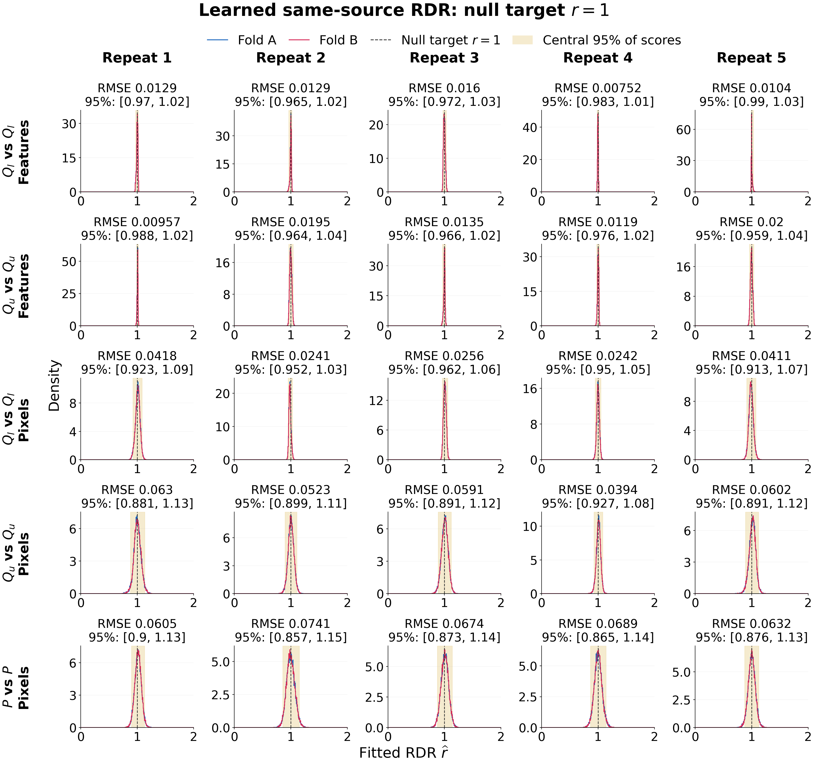

# CelebA publication figures: three-digit ranges and null histograms

**Complete: four unchanged image selections with shorter labels; histograms for all 25 learned null fits.**

Image endpoints use three significant digits, retaining scientific notation for small scores. The image identities, ordering, scores, and numerical experiment results are unchanged. Underlying CSVs retain full precision.

## Null RDR histograms

The overview has five families in rows and five fitted repetitions in columns. Each panel overlays density histograms for disjoint source folds A and B and marks the known null RDR 1. Both original final roles are merged within each fold. Repeats 1–5 correspond to saved repeats 00–04. All score histograms share 400 equal bins over [0,2]; each fold histogram integrates to one.

The shaded central 95% is the [0.025,0.975] inverse empirical CDF interval of the equally weighted A/B score distributions. It describes fitted-score dispersion, not a confidence interval or a cell-calibration coverage claim. Panel titles report balanced RDR RMSE against the known truth 1. There is no score clipping, exact-one substitution, refitting, or best-repeat selection.

[Overview PDF](null_rdr_histograms.pdf). For publication, the five family PDFs below are 7.2 inches wide with 10-point ticks/panel titles and 12-point axis labels; they avoid shrinking a 25-panel overview to an unreadable size. The overview uses 19-point ticks and panel titles.

- feature / lower: [PDF](null_rdr_histograms_feature_lower.pdf) · [PNG](null_rdr_histograms_feature_lower.png)
- feature / upper: [PDF](null_rdr_histograms_feature_upper.pdf) · [PNG](null_rdr_histograms_feature_upper.png)
- pixel / lower: [PDF](null_rdr_histograms_pixel_lower.pdf) · [PNG](null_rdr_histograms_pixel_lower.png)
- pixel / upper: [PDF](null_rdr_histograms_pixel_upper.pdf) · [PNG](null_rdr_histograms_pixel_upper.png)
- pixel / real: [PDF](null_rdr_histograms_pixel_real.pdf) · [PNG](null_rdr_histograms_pixel_real.png)

[Histogram summaries](null_histogram_summary.csv) · [All bin counts and densities](null_histogram_bins.csv)

## Compact image samples

[PDF](images_feature_lower_ranked.pdf)

[PDF](images_feature_upper_ranked.pdf)

[PDF](images_pixel_lower_ranked.pdf)

[PDF](images_pixel_upper_ranked.pdf)

[Image identities and scores](selected_images.csv) · [Full-precision actual ranges](image_ranges.csv)

The unchanged merged-test numerical report remains in `merged_test_20261003/RESULTS.md`. This separate presentation supplement preserves the earlier sealed figures and records its own sources and hashes.
