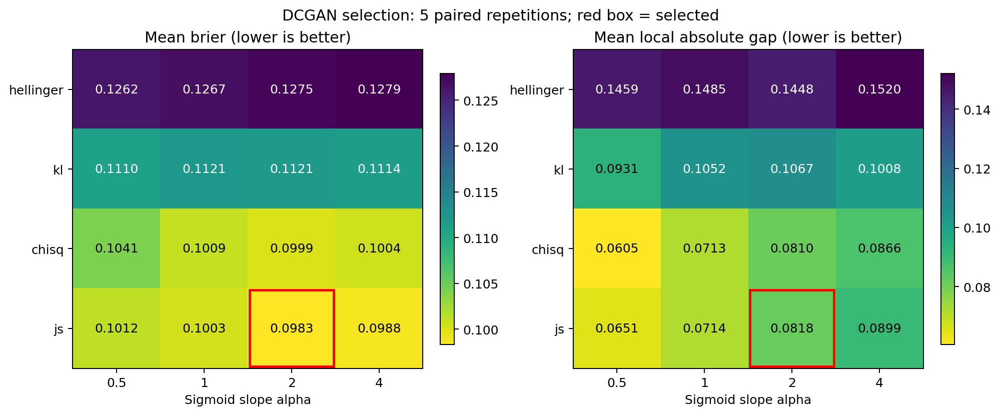
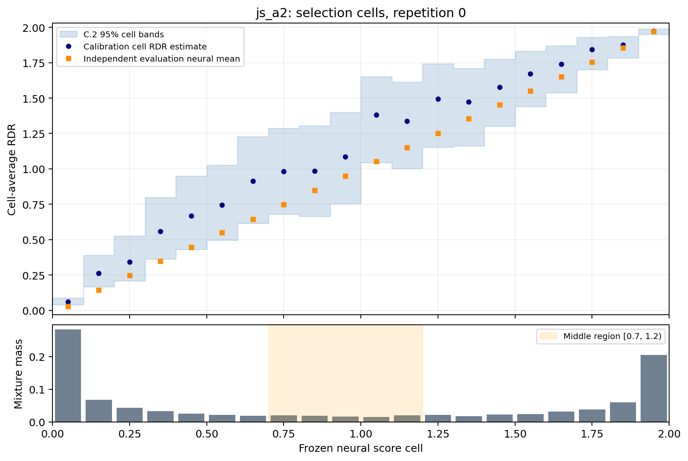
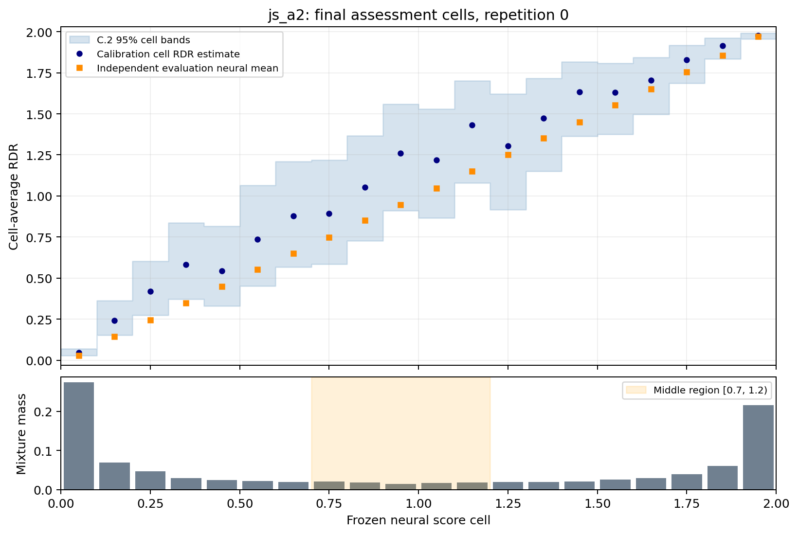

# MNIST DCGAN model selection

**Status: Selection and all selected-model final assessments complete.**
**Smoke study: no.**
Verified 80/80 selection fits and 5/5 final assessments.

**Selected:** `js_a2` (js; r=2 sigmoid(2 z)).
Brier-reference candidate: `js_a2`.

## Registered selection procedure

Each checkpoint is chosen by the smallest early-stopping balanced Brier. Reference: minimum mean balanced Brier. Shortlist: mean paired Brier difference from reference <= one standard error of paired differences + 1e-12, with supported evaluation mass >= 0.99 in every repeat. Choose smallest mean local absolute gap, then mean Brier, then candidate ID. The repeat standard error is descriptive conditional on the fixed MNIST data; it is not a confidence interval or an independent-data uncertainty estimate.

Brier uses labels P=1, Q=0 and probability r/2, with equal source weights. Local gap is the evaluation-mixture-mass-weighted absolute difference between the independently estimated neural cell mean and calibration cell RDR estimate, normalized over supported mass. C.2 distance measures distance of that neural mean from the calibration interval; width is weighted across all evaluation mass. Support records evaluation mass with both a neural mean and a calibration point estimate. The middle region is [0.7, 1.2).

## Split accounting

| Role | Real-image source | P count | Q count |
| --- | --- | --- | --- |
| train | official training | 45,000 | 45,000 fresh draws per epoch |
| earlystop | official training | 5,000 | 5,000 |
| selection_calibration | official training | 5,000 | 5,000 |
| selection_evaluation | official training | 5,000 | 5,000 |
| final_calibration | official test | 5,000 | 5,000 |
| final_evaluation | official test | 5,000 | 5,000 |

Real-image roles are disjoint. All candidates use paired real observations, initializations and generator seeds within each repetition. Real splits stay fixed across repetitions; initializations and Q samples change. P and Q input pixels use [-1,1].

## Selection diagnostics

Entries are mean (sample SD) across 5 paired repetitions, conditional on the fixed real data. These are not sampling confidence intervals. Unavailable middle-region values are reported with their available repetition count and are not averaged after dropping missing values.

| Candidate | Brier | Local absolute gap | C.2 distance | C.2 width | Supported mass |
| --- | --- | --- | --- | --- | --- |
| chisq_a0p5 | 0.104139 (0.001614) | 0.060505 (0.006814) | 0.000496 (0.000482) | 0.236327 (0.004241) | 1.000000 (0.000000) |
| chisq_a1 | 0.100933 (0.001812) | 0.071271 (0.006050) | 0.000458 (0.000457) | 0.231468 (0.002848) | 1.000000 (0.000000) |
| chisq_a2 | 0.099923 (0.001132) | 0.080981 (0.006875) | 0.001524 (0.001171) | 0.228518 (0.002521) | 1.000000 (0.000000) |
| chisq_a4 | 0.100436 (0.001889) | 0.086566 (0.009991) | 0.001754 (0.000697) | 0.230472 (0.001739) | 1.000000 (0.000000) |
| hellinger_a0p5 | 0.126183 (0.000886) | 0.145931 (0.009806) | 0.059886 (0.005816) | 0.250533 (0.005045) | 1.000000 (0.000000) |
| hellinger_a1 | 0.126685 (0.002283) | 0.148526 (0.012739) | 0.061455 (0.009103) | 0.248477 (0.004094) | 1.000000 (0.000000) |
| hellinger_a2 | 0.127505 (0.001672) | 0.144823 (0.014140) | 0.060092 (0.009232) | 0.251480 (0.005434) | 1.000000 (0.000000) |
| hellinger_a4 | 0.127931 (0.001474) | 0.152048 (0.012471) | 0.063031 (0.008887) | 0.253664 (0.007334) | 1.000000 (0.000000) |
| js_a0p5 | 0.101151 (0.001479) | 0.065127 (0.006986) | 0.000673 (0.000548) | 0.233147 (0.003086) | 1.000000 (0.000000) |
| js_a1 | 0.100312 (0.001547) | 0.071364 (0.005624) | 0.001431 (0.000237) | 0.231762 (0.003713) | 1.000000 (0.000000) |
| js_a2 | 0.098344 (0.001700) | 0.081758 (0.007296) | 0.005902 (0.000666) | 0.227300 (0.003053) | 1.000000 (0.000000) |
| js_a4 | 0.098767 (0.001146) | 0.089918 (0.009525) | 0.010364 (0.003044) | 0.228784 (0.002432) | 1.000000 (0.000000) |
| kl_a0p5 | 0.111045 (0.001252) | 0.093092 (0.010687) | 0.011962 (0.003940) | 0.242532 (0.003630) | 1.000000 (0.000000) |
| kl_a1 | 0.112140 (0.001370) | 0.105211 (0.033794) | 0.023984 (0.011296) | 0.239860 (0.007529) | 1.000000 (0.000000) |
| kl_a2 | 0.112054 (0.002613) | 0.106727 (0.030133) | 0.024864 (0.013241) | 0.240700 (0.007099) | 1.000000 (0.000000) |
| kl_a4 | 0.111350 (0.001355) | 0.100826 (0.025872) | 0.023120 (0.013990) | 0.241763 (0.007340) | 1.000000 (0.000000) |

| Candidate | Middle mass | Middle supported mass | Middle gap |
| --- | --- | --- | --- |
| chisq_a0p5 | 0.116740 (0.003344) | 0.116740 (0.003344) | 0.137066 (0.031864) |
| chisq_a1 | 0.107940 (0.003699) | 0.107940 (0.003699) | 0.162875 (0.011040) |
| chisq_a2 | 0.101760 (0.001965) | 0.101760 (0.001965) | 0.198961 (0.030729) |
| chisq_a4 | 0.100640 (0.003574) | 0.100640 (0.003574) | 0.206591 (0.039697) |
| hellinger_a0p5 | 0.076200 (0.004115) | 0.076200 (0.004115) | 0.167290 (0.032570) |
| hellinger_a1 | 0.073080 (0.004296) | 0.073080 (0.004296) | 0.205894 (0.080270) |
| hellinger_a2 | 0.075860 (0.004799) | 0.075860 (0.004799) | 0.161928 (0.067662) |
| hellinger_a4 | 0.079820 (0.003549) | 0.079820 (0.003549) | 0.220209 (0.084772) |
| js_a0p5 | 0.097940 (0.003567) | 0.097940 (0.003567) | 0.160898 (0.032534) |
| js_a1 | 0.094220 (0.002918) | 0.094220 (0.002918) | 0.169420 (0.016950) |
| js_a2 | 0.089580 (0.002453) | 0.089580 (0.002453) | 0.195481 (0.036742) |
| js_a4 | 0.087580 (0.001842) | 0.087580 (0.001842) | 0.201632 (0.033831) |
| kl_a0p5 | 0.097080 (0.004698) | 0.097080 (0.004698) | 0.225077 (0.034860) |
| kl_a1 | 0.092760 (0.006712) | 0.092760 (0.006712) | 0.225902 (0.110596) |
| kl_a2 | 0.089980 (0.004243) | 0.089980 (0.004243) | 0.237436 (0.079646) |
| kl_a4 | 0.088540 (0.006803) | 0.088540 (0.006803) | 0.239643 (0.086704) |

[Grid PDF](selection_grid.pdf)

[Selection cells PDF](selected_selection_cells.pdf)

## Assessment after selection was frozen

| Candidate | Brier | Local absolute gap | C.2 distance | C.2 width | Supported mass |
| --- | --- | --- | --- | --- | --- |
| js_a2 | 0.091056 (0.000968) | 0.066951 (0.007814) | 0.002201 (0.000538) | 0.224923 (0.005851) | 1.000000 (0.000000) |

| Candidate | Middle mass | Middle supported mass | Middle gap |
| --- | --- | --- | --- |
| js_a2 | 0.088760 (0.003547) | 0.088760 (0.003547) | 0.180317 (0.030899) |

[Final cells PDF](selected_final_cells.pdf)

## Interpretation and provenance

The 20 score cutoffs are fixed, but their input-space cells depend on each fitted network. The nominal 95% C.2 intervals are simultaneous over cells for one fixed model under the calibration assumptions. They target population cell-average RDR, not individual-image RDR. Selection-stage intervals are unadjusted across candidate models; they do not provide a joint guarantee after model selection. Neural cell means also have sampling uncertainty that the displayed calibration intervals do not include. Repetition-0 cell figures are descriptive examples; all repetitions enter the tables.

Official-test images were inspected in historical MNIST studies. Final assessment here is retrospective, although these roles are excluded from this selection procedure. Frozen DCGAN pretraining membership has not been audited. This study does not replace the retained VAE, DCGAN, digit-perturbation results or the validation-only null diagnostic.

[Per-fit metrics](per_fit.csv) · [Summary metrics](summary.csv) · [Frozen protocol](protocol.json) · [Split manifest](splits.json) · [Frozen selection](selection.json)
