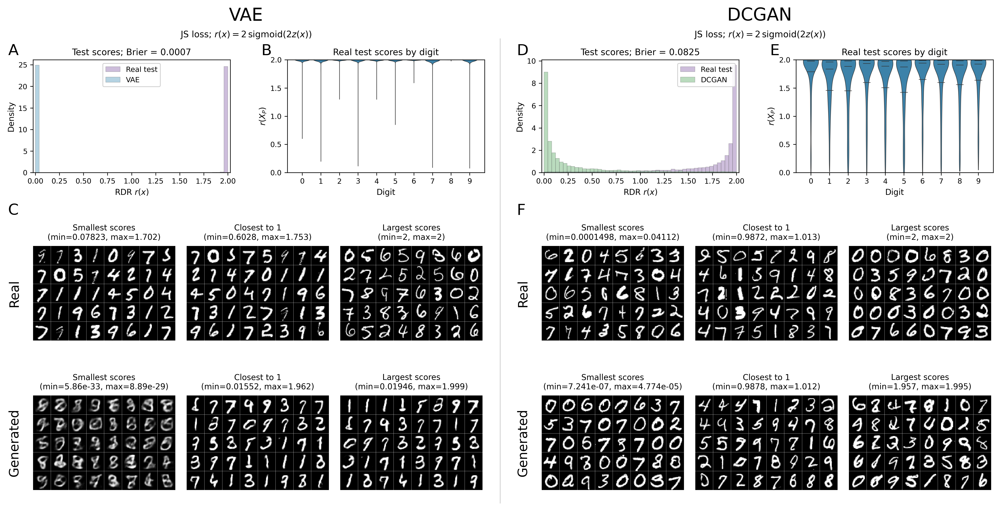

# MNIST comparison after model selection

Frozen DCGAN selection: **JS, r = 2 sigmoid(2 z)**.
The same configuration is transferred to VAE without another model search.
Both RDR networks were initialized and trained afresh; pretrained generators stayed fixed.

| Generator | Best epoch | Validation Brier | Whole-test Brier | Local absolute gap | Supported mass |
| --- | ---: | ---: | ---: | ---: | ---: |
| VAE | 19 | 0.000367 | 0.000748 | 0.001505 | 0.999400 |
| DCGAN | 17 | 0.085285 | 0.082477 | 0.018135 | 1.000000 |

Real data: 55,000 fitting, 5,000 fixed validation, 10,000 official test images.
The real split exactly follows the historical comparison (except explicitly marked smoke runs).
Q has the same counts: fresh draws each training epoch, fixed independent validation draws, and independent test draws.
Both branches use the selected CNN/Adam/OneCycle recipe: maximum 20 epochs, minimum 6, Brier patience 5, BN frozen from zero-based epoch 5.
The checkpoint is saved and restored before final-data scoring. All model inputs use [-1,1]; display alone uses [0,1].

Whole-test Brier uses all 10,000 P and 10,000 Q scores. Local discrepancy uses disjoint 5,000-P/5,000-Q calibration and 5,000-P/5,000-Q evaluation roles (smoke counts are smaller).
The real diagnostic partition is the frozen selection study's official-test partition; Q is split into two independent halves of its new test draw.
C.1/C.2 intervals concern cell-average true RDR; neural cell means have sampling uncertainty. The saved cells and coverage diagnostics do not provide pointwise image guarantees.

This is a post-selection refit. The official test set has been inspected in earlier studies, and generator pretraining membership is unaudited.
Historical RDRs used Hellinger (including a 3-epoch VAE run); this new matched 20-epoch-cap procedure is not a loss-only controlled comparison. Historical results remain preserved.
The mosaics show 40 smallest, closest-to-one, and largest scores per side. These selected illustrations do not estimate prevalence.

The PDF, exact panel positions, full saved images/scores, checkpoints, history, calibration cells, frozen inputs/source, and SHA manifests accompany this report.
Selection SHA256: `48807a984a9ad3c9dd3238c3be4465cbf3b486b1c0646354fc8bd9c01681ff60`.
Protocol SHA256: `227062d55c4c1450332670649025b6ccdccdb74c35a58d094aab0f12d7d8d2fa`.
Smoke run: `False`.
