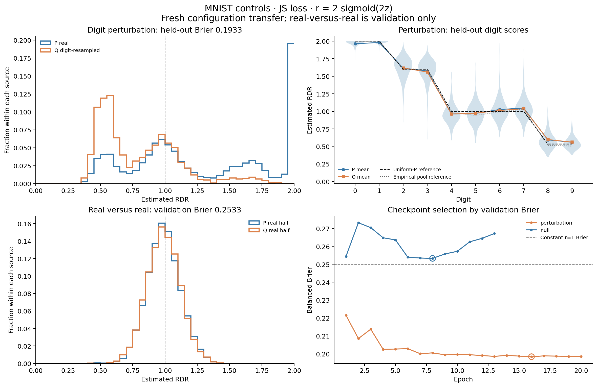
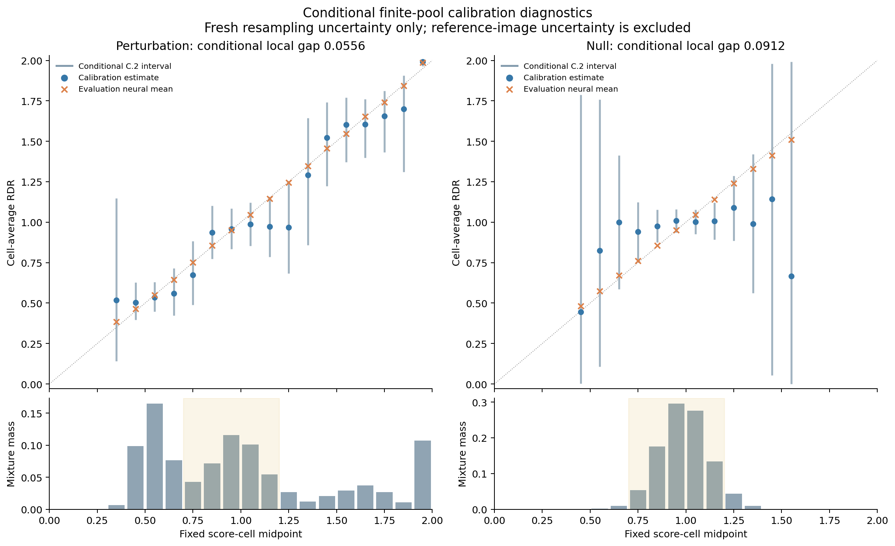

# MNIST selected-model perturbation and null

Transferred DCGAN selection: **JS, r = 2 sigmoid(2 z)**.
Both networks were initialized and trained afresh, without another configuration search.

| Experiment | Primary role | Best epoch | Validation Brier | Primary Brier | Conditional local gap | Supported mass |
| --- | --- | ---: | ---: | ---: | ---: | ---: |
| perturbation | test | 16 | 0.198432 | 0.193262 | 0.055599 | 1.000000 |
| null | validation | 8 | 0.253278 | 0.253278 | 0.091185 | 1.000000 |

## Role counts and checkpoint selection

Full perturbation protocol: 60,000 P and 60,000 fixed resampled Q training rows; 5,000 P/Q validation rows; 5,000 P/Q held-out evaluation rows.
Its training source is official MNIST train; the two official-test halves provide disjoint validation and evaluation source images. Repeated Q rows are not additional source images.
Full null protocol: disjoint 30,000/30,000 official-training halves; disjoint 5,000/5,000 test-derived validation halves. **The null has no independent final-test evaluation.**
The saved primary indices reproduce historical seed 123/133 partitions and Q seeds 143/153/163. Smoke runs explicitly use smaller pools.
Training uses the selected CNN, batch size 512, Adam/OneCycle (max_lr 0.0006), maximum 20/minimum 6 epochs, patience 5, and BN frozen from epoch index 5. Every training row is used each epoch; historical drop_last=True omitted 96 perturbation rows and 304 null rows per source per epoch.
Checkpoint selection uses validation balanced Brier only. Its state is saved and reloaded before final or fresh diagnostic scoring. All model inputs use [-1,1].

## Calibration-CI interpretation

Conditional finite-pool Monte Carlo intervals after freezing the fitted network: the reference images are fixed; only independent resampling draws are random. Repeated images are not additional independent source images. These intervals exclude reference-image sampling uncertainty and are not population or pointwise guarantees.
Each calibration and diagnostic-evaluation role draws 5,000 P and 5,000 Q rows independently using separate frozen RNG seeds (smoke: 80 per side). They can repeat and share image identities while their random draws are independent conditional on the reference pool.
Perturbation reference: its 5,000 held-out source images, P uniform and Q sampled at the controlled digit probabilities. Null reference: its pooled 10,000 test-derived validation images, P=Q uniform. The latter is an auxiliary common-source validation diagnostic.
C.1/C.2 intervals target cell-average RDR for these empirical distributions. Neural cell means have separate evaluation sampling uncertainty. Broad intervals and small overall gaps do not establish local or individual-image accuracy.
The fixed 20 bins span [0,2]. The following region [0.7,1.2) is reported separately:

| Experiment | Middle mixture mass | Supported fraction | Conditional local gap |
| --- | ---: | ---: | ---: |
| perturbation | 0.384600 | 1.000000 | 0.064963 |
| null | 0.935100 | 1.000000 | 0.082874 |

Controlled Q digit probabilities are [0,0,.025,.025,.10,.10,.10,.10,.275,.275]. The nominal reference ratios are [2,2,1.6,1.6,1,1,1,1,0.533333,0.533333], assuming uniform P and a common within-digit distribution. The digit plot also shows the empirical source-pool frequency reference; no MAE/MSE criterion is used.
Under the common-source null the target is r=1 and its population Brier baseline is 0.25. Historical official-test inspection makes these post-selection analyses retrospective.

The run contains frozen raw inputs, source, index manifest, checkpoints, all primary and diagnostic scores/indices, digit tables, histories, cells, and SHA256 completion manifests. `report` replays tables/figures from saved scores without training.
Selection SHA256: `48807a984a9ad3c9dd3238c3be4465cbf3b486b1c0646354fc8bd9c01681ff60`.
Protocol SHA256: `3d1cb7f3e9a396e88c34b786558f49e4a5f16857fce3a3d126a405511e8113af`.
Smoke run: `False`.
